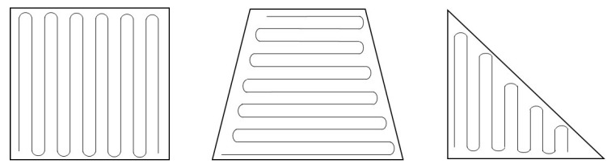
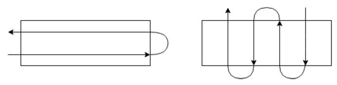
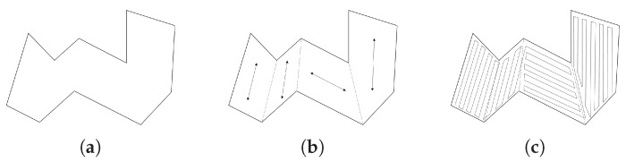
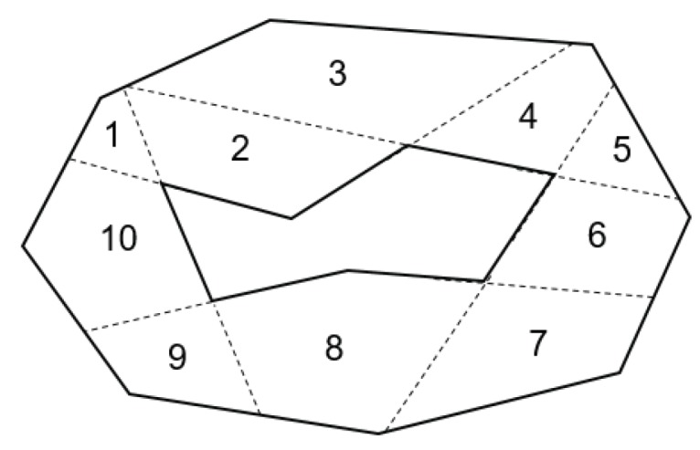
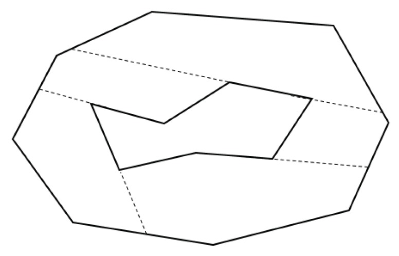

#! https://zhuanlan.zhihu.com/p/430612058
# 覆盖规划算法 （Updating)

这里的覆盖规划算法主要是解决二维区域的问题。 书中介绍了两种方法。

> Book: 
> - [Planning Algorithm -- Steven M. LaValle](http://lavalle.pl/planning/)
>   - [Boustrophedon decomposition](http://lavalle.pl/planning/node352.html)
>   - [Spanning tree covering](http://lavalle.pl/planning/node353.html)

## 1. Boustrophedon decomposition 

> ref: [Convex Decomposition for a Coverage Path Planning for Autonomous Vehicles: Interior Extension of Edges](https://www.ncbi.nlm.nih.gov/pmc/articles/PMC6806237/)

### 1.1 全覆盖路径规划

127 / 5000
翻译结果
Boustrophedon 意思是牛耕地的方式，是利用平行线覆盖区域。 该模式如下图所示。 

当地图为凸多边形时，Boustrophedon 很容易应用于覆盖任务。 这部分的主要优化是减少转弯，因为转弯比直行花费更多的能量和时间。

但是，当该区域复杂且凹陷时，难度会提高。 复杂地图的一种方法是将其分解为凸子区域。 然后将boustrophedon应用到每个子区域，连接这个覆盖路径子区域，完成整个覆盖路径规划。 连接方法被表述为旅行商问题。 我们需要做的是尽量减少机器人访问所有子区域的次数。

### 1.2 分解方法 

机器人在子多边形中规划路径并不难。 然而，难点在于如何将区域分割成子区域并实现最优路径。

[Interior Extension of Edges](https://www.ncbi.nlm.nih.gov/pmc/articles/PMC6806237/) 是一个不错的方法. 它首先确定目标多边形两条边之间的内角是否大于 180 度。 然后延伸这些选取的角度的边缘，直到它们碰到地图的边界，如下图所示。

之后，需要合并相邻的子多边形以减少子区域。 这个过程的原则是合并后的多边形必须是凸的。 在这个过程中，我们可以得到一组合并选项。 其中，最好的选择是总宽度最小的那个。

### 1.3 方法细节

> ref: [A phd dissertation of Coverage Planning Problem and Traveling Salesman Problems](https://etd.auburn.edu/bitstream/handle/10415/4599/Optimization%20Approaches%20for%20a%20Dubins%20Vehicle%20in%20Coverage%20Planning%20Problem%20and%20Traveling%20Salesman%20Problems.pdf?sequence=2)

### 1.4 代码

> ref: [RicheyHuang/CoveragePlanner](https://github.com/RicheyHuang/CoveragePlanner)