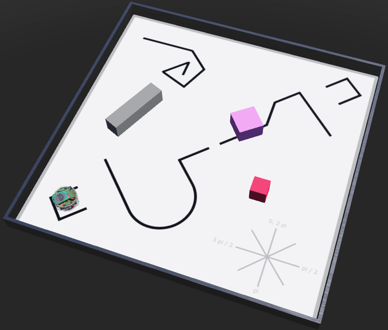
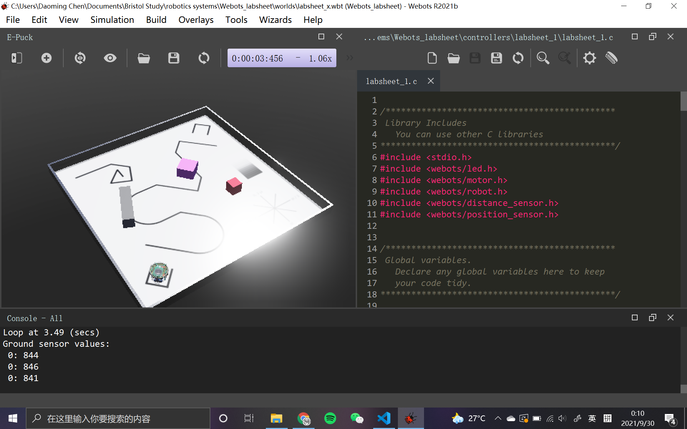
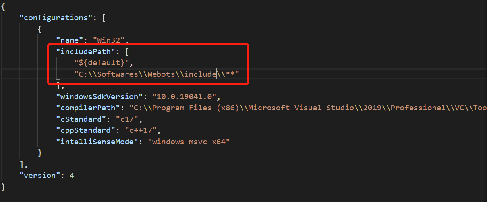
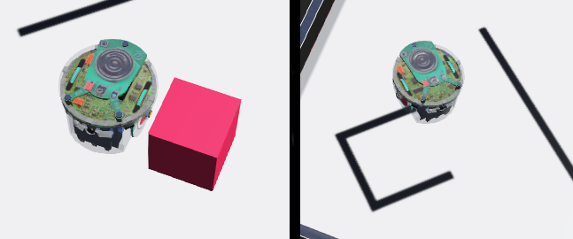

#! https://zhuanlan.zhihu.com/p/414973593
# Lec1. Introduction to robotic systems

> 由此访问[专栏目录](https://zhuanlan.zhihu.com/p/414973930)
## Lec

第一节课关于机器人的系统大部分的内容都没有以概念的形式呈现出来，更多的是需要我们动手实践，以仿真或者实体的形式去编写机器人的程序。

关于概念性的内容可以查阅书籍：

[An introduction to AI robotic](https://pan.baidu.com/s/17tX8JgnGJYG7LJ85EoXC3Q "card")
提取码：ht09

目前阶段的教学任务就是编写一个小车寻线的程序。使用实体机器人 3pi 或者 机器人仿真系统 Webots。实验有关的内容已经托管在了 github 上

[ ](https://github.com/Alexbeast-CN/EMATM0053_21_22 "card")



## Lab

>有关实验过程演示的视频(已搬运到b站，安心食用）：

[A recording of a solution to the course work line following challenge 【生肉】](https://www.bilibili.com/video/BV1Qf4y1F7XK "card")

[3Pi+ Line Following Challenge Map 【生肉】](https://www.bilibili.com/video/BV1aL4y1z7oT "card")

### 1. Getting started

关于 webots 界面的操作方法可以查看 [webots 的官方介绍](https://cyberbotics.com/doc/guide/getting-started-with-webots)，这里就不再多说，直接看老师提供的控制器代码。

**老师提供的代码**

```c
/*********************************************
 Library Includes
   You can use other C libraries
**********************************************/
#include <stdio.h>                   
#include <webots/led.h>
#include <webots/motor.h>
#include <webots/robot.h>
#include <webots/distance_sensor.h>
#include <webots/position_sensor.h>


/*********************************************
 Global variables.  
   Declare any global variables here to keep
   your code tidy.
**********************************************/

// simulation time step is 32ms
#define TIME_STEP 32  

// 3 IR ground sensors
#define NB_GROUND_SENS 3
#define GS_LEFT 0
#define GS_CENTER 1
#define GS_RIGHT 2
WbDeviceTag gs[NB_GROUND_SENS]; /* ground sensors */
unsigned short gs_value[NB_GROUND_SENS] = {0, 0, 0};

// Motors
WbDeviceTag left_motor, right_motor;

// LEDs
#define NB_LEDS 8
WbDeviceTag led[NB_LEDS];

// Proximity Sensors
#define NB_PS 8
WbDeviceTag distance_sensor[NB_PS];

// Position Sensors (encoders)
WbDeviceTag left_position_sensor, right_position_sensor;


/*********************************************
 Function prototypes.  
   Tells the C compiler what functions we have 
   written within this source file
**********************************************/

// One time setup, at beginning of simulation
void setup( );

// Controller to be called again and again.
void loop( );

// An example function to cause a delay
void delay_ms( float ms );


/*********************************************
 Main loop. 
   This is the main thread of our C program.
   For this unit of study, it is recommended
   you do not alter the structure of main()
   below.  Instead, you should work from the
   functions setup() and loop().  You are 
   free to create your own useful functions.
**********************************************/
int main(void) {

  // Initialise Webots - must be done!
  wb_robot_init();

  // Code called here happens before the 
  // simulator begins running properly.
  setup();

  // Run the simulator forever.
  while( wb_robot_step(TIME_STEP) != -1 ) {
      
    // Call robot controller loop
    loop();
  }


  return 0;
}


/*********************************************
 setup()
   Use this function to setup any variables
   or robot devices prior to the start of your
   simulation.
**********************************************/
void setup() {

  // Initialise simulation devices.
  char name[20];
  int i;
  
  // Setup LEDs
  for (i = 0; i < NB_LEDS; i++) {
    sprintf(name, "led%d", i);
    led[i] = wb_robot_get_device(name); /* get a handler to the sensor */
  }
  
  // Setup Ground Sensors
  for (i = 0; i < NB_GROUND_SENS; i++) {
    sprintf(name, "gs%d", i);
    gs[i] = wb_robot_get_device(name); /* ground sensors */
    wb_distance_sensor_enable(gs[i], TIME_STEP);
  }
  
  // Setup motors
  left_motor = wb_robot_get_device("left wheel motor");
  right_motor = wb_robot_get_device("right wheel motor");
  wb_motor_set_position(left_motor, INFINITY);
  wb_motor_set_position(right_motor, INFINITY);
  wb_motor_set_velocity(left_motor, 0.0);
  wb_motor_set_velocity(right_motor, 0.0);
  
  // get a handler to the position sensors and enable them.
  left_position_sensor = wb_robot_get_device("left wheel sensor");
  right_position_sensor = wb_robot_get_device("right wheel sensor");
  wb_position_sensor_enable(left_position_sensor, TIME_STEP);
  wb_position_sensor_enable(right_position_sensor, TIME_STEP);
  
  // Setup proximity sensors
  for (i = 0; i < 8; i++) {
    
    // get distance sensors 
    sprintf(name, "ps%d", i);
    distance_sensor[i] = wb_robot_get_device(name);
    wb_distance_sensor_enable(distance_sensor[i], TIME_STEP);
  }
  
  // You can add your own initialisation code here:
  // ...
}


/*********************************************
 loop()
   Use this function to build the structure of 
   your robot controller.  Remember that we 
   expect this function to be called again and
   again (iteratively).  
**********************************************/
void loop() {
  
  // Report current time.
  printf("Loop at %.2f (secs)\n", wb_robot_get_time() );
  
  // Get latest ground sensor readings
  gs_value[0] = wb_distance_sensor_get_value(gs[0]);
  gs_value[1] = wb_distance_sensor_get_value(gs[1]);  
  gs_value[2] = wb_distance_sensor_get_value(gs[2]);
  
  // Report ground sensor values
  printf("Ground sensor values: \n");
  printf(" 0: %d\n", gs_value[0] );
  printf(" 0: %d\n", gs_value[1] );
  printf(" 0: %d\n\n", gs_value[2] );
  
  // Call a delay function
  delay_ms( 500 );
}


/*********************************************
 void delay_ms( float ms )
  This simple function causes the simulator to continue
  advancing for a requested amount of milliseconds.  
  Note that, the wb_robot_step is advancing at TIME_STEP
  and so this function causes an innaccurate delay.
**********************************************/
void delay_ms( float ms ) {
  float millis_now;
  float millis_future;
  
  millis_now = wb_robot_get_time() * 1000.0;
  millis_future = millis_now + ms;
  
  // Wait for the elapsed time to occur
  // Note, steps simulation, so blocks
  // any further updates the rest of the code.
  while( millis_now < millis_future ) {
    millis_now = wb_robot_get_time() * 1000.0;
    wb_robot_step( TIME_STEP );
  } 
  
  return;
}
```

#### 1.1 将编辑器换成 vscode



win 上的 `webots` 的界面实在是太丑了，还是换到我熟悉的 `vscode` 比较舒服。

只需要做一步，就是把 `webots` 库的路径添加进 `vscode` 就可以了。使用快捷键 `f1` 打开搜索栏，再输入 `C/C++:Edit Configuration(JSON)` 打开配置文件，添加你安装`webots`的路径`"xxx\\Webots\\include\\**"`，就可以在`vscode`上进行开发了。



#### 1.2 Exercise 1: Motor Velocity (2hours)

1. Conduct some research: what type of motor does the real e-puck use to rotate it's wheels?  
 - what are some advantages to this type of motor?
 - what are some disadvantages to this type of motor?

**Ans:** 
E-puck robot uses 2 stepper motors with 20 steps per revolution and a 50:1 reduction gear.
 - The advantages are each and easy to control.
 - The disadvantages are difficult to run at a higher speed and difficult to obtain large torque. 

ref: https://cyberbotics.com/doc/guide/epuck

2. Explore: Write a controller to have your robot move fowards continuously.

**Ans:**
Change the code block as follows to move the robot fowards:
```c
void moving_forwards()
{  
wb_motor_set_velocity(left_motor, 1.0);
wb_motor_set_velocity(right_motor, 1.0);
}
```

3. Explore: Write a controller to have your robot move backwards continuously.

**Ans:**
Change the code block as follows to move the robot backwards:
```c
void moving_backwards()
{
wb_motor_set_velocity(left_motor, -1.0);
wb_motor_set_velocity(right_motor, -1.0);
}
```

4. Explore: Find the maximum and minimum velocities which can be used with the motors.

**Ans:**
 - The maximum forwards velocity is 0.25 m/s 
 - The maximum rotation speed is 6.28 rad/s

ref: https://cyberbotics.com/doc/guide/epuck#devices-names

5. Solve: Write a controller to increment a positive motor velocity on each simulation time step to maximum velocity, and then to decrement the motor velocity back to zero at each time step.
 - tip: create a variable to store the last motor velocity used.  
 - tip: it might be useful to create a variable to store whether you are currently incrementing or decrementing the motor velocity.
 - tip: remember to consider `local` and `global` scope of variables.

6. Explore: Write a controller to have your robot rotate on the spot (i.e. no forward or backward movement).
 - which pair of values cause the robot to rotate left?
 - which pair values cause the robot to rotate right?

**Ans:**
Change the code block as follows to move the robot rotate right:
```c
void rotate_right()
{
wb_motor_set_velocity(left_motor, 1.0);
wb_motor_set_velocity(right_motor, -1.0);
}
```

Change the code block as follows to move the robot rotate left:
```c
void rotate_left()
{
wb_motor_set_velocity(left_motor, -1.0);
wb_motor_set_velocity(right_motor, 1.0);
}
  
```

7. Solve: Find the best motor velocities to have your robot move on an arc, to trace the same half-circle curve of the provided line following map. 

#### 1.3 Exercise 2: Time (3hours)

1. When your (simulated or real) robot reads the time that has passed since it was activated, is this **`exteroceptive`** or **`proprioceptive`** information?

**Ans:**
The time is proprioceptive information.

2. Solve: Use `wb_robot_get_time()` to program your robot to drive forwards for the first 4 seconds of simulation, and then stop.

**Ans:**
Add a condition to motor speed code block in the loop function:

```c
void loop() {
...
if (wb_robot_get_time() < 4.0)
{
  moving_forwards();
}
else
{
  stop_moving();
}
...
}
```
3. Solve: Write some code so that your robot drives forwards for 2 seconds, then stops for 2 seconds, and can repeat this procedure endlessly. 
  - **help**: to implement this, considering capturing the **`elapsed time`** (or difference in time, `dt`).  You can use `global variables` to operate as `time stamps` - a variable to record the time value on specific events.
  - **help**: it is useful to write a function to operate as a timer to return a `true` or `false` value if a requested period of time has elapsed.

**Ans：**
- write a bool timer

```c
bool timer(double t, bool flag)
{
  if (wb_robot_get_time() < t + DT)
  {
    flag = 1;
  }
  else if (wb_robot_get_time() < t + 2*DT)
  {
    flag = 0;
  }
  return flag;
}
```

- write the moving function in loop
  
```c
  static  bool flag = 1;
  int tim_now = wb_robot_get_time();
  int t = ZERO + tim_now;

  if (timer(t,flag))
  {
    moving_forwards();
  }
  else
  {
    stop_moving();
  }
  ```


4. Solve: Adjust the code for (3) so that your robot drives forwards for 2 seconds, and then turns right for 2 seconds, and repeats this procedure endlessly.
  - Can you adjust your code so that the robot coordinates its motion to create square pattern?
  - Can you adjust the time values so that your robot can trace the square starting box on the line following map provided?
  - Alternatively, adjust the time values so that your robot can move around one of the square obstacles without colliding.

> Kinda easy for me. Skiped.

1. Are these exercises implementing **`closed-loop`** or **`open-loop`** control?

**Ans:**
They are open-loop control.



