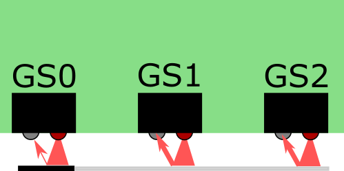
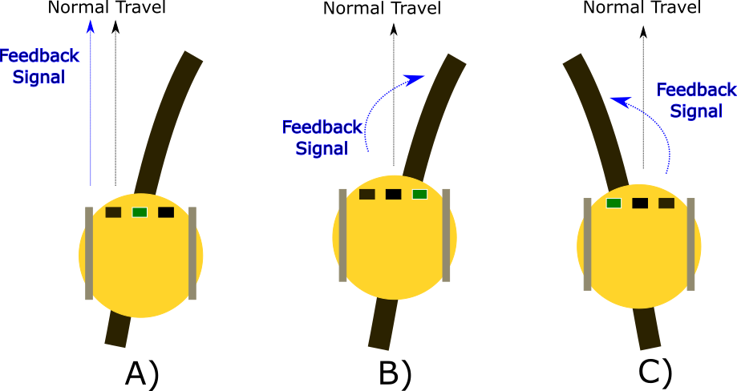
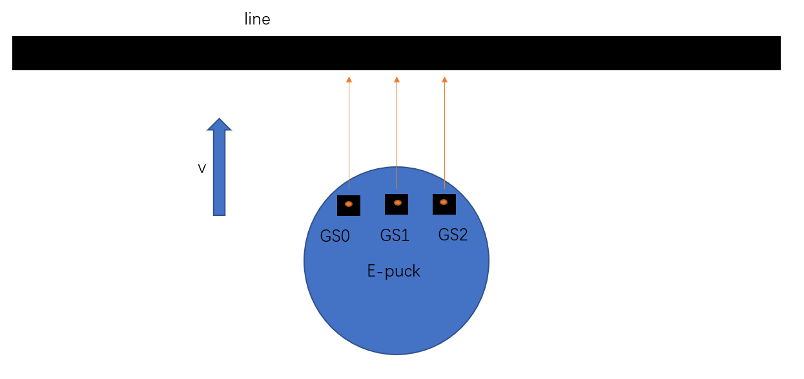
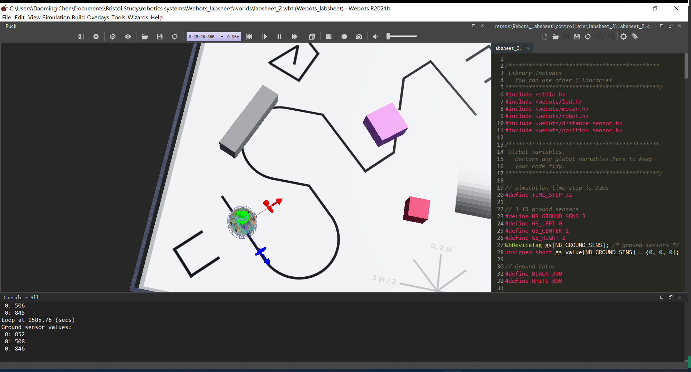

#! https://zhuanlan.zhihu.com/p/416903088
# Lec2. Line follower
> 程序目前还有一点问题，欢迎 issue 与 contribute。更新中...

## Lec

## Lab

> 本阶段的笔记基于 `labsheet2` line following

### Sec1. Ground sensor

为了达成巡线的目的，本阶段 `e-puck` 机器人提供了，使用基于红外反射原理的地面传感器。传感器照射到不同颜色时，会返回不同的信号。 这种传感器只在特定的情况下有用（高对比度，低干扰 的实验地面）。而3个传感器（`GS0`, `GS1`, `GS2`）两两之间的间距为 12mm，因此决定了，机器人对于黑线宽度的要求为小于等于12mm。传感器原理图如下：



想要利用传感器达成实验目的所提供的解决方案也很简单，如下图所示：



当传感器`GS0`返回信号为 “黑” 时，则机器人需要直行。而如果是`GS0`/`GS2`时，机器人则需要左转或右转。

### Exercise 1: Ground Sensor (30 minutes)

Feel free to discuss these questions with your peers:

1. Is the ground sensor an **`active`** or **`passive`** sensor?  What informs your answer?

**Ans:**

It's an **active** sensor, because it can transmit a beam of infra-red light, and then measuring the intensity of the reflection.

ref: [Passive vs. Active Sensing](https://www.nrcan.gc.ca/maps-tools-publications/satellite-imagery-air-photos/remote-sensing-tutorials/introduction/passive-vs-active-sensing/14639)

2. Using the logic provided above, what would you expect to observe your robot do if it started off the line (not on the line)?

**Ans:**

If the robot is starting off the line, I expect it can turn itself to trying to get back to line. To be more specific, if the side sensor's (GS0/GS2) is black, then it will turn itself to get back to GS1 is black.
  
3. What motion would you expect to observe in the robot motion if the feedback-signal was inverted?
  - is there a case where line following can be achieved with an inverted feedback signal?

> see ans2.

4. An exceptional case not caught with the above logic would be if all three ground-sensors were activated simultaneously.  This can happen even though the black line is less than 12mm wide.  Under what condition might this occur?

**Ans:**



5. What would be appropriate feedback responses for exceptional (non-defined) cases of the sensor activation?

> Skiped

6. If your robot was to calculate a performance score within `loop()` for line-following (a **`metric`**) as it operated:
  - what **`proprioceptive`** information could be used?
  - what **`exteroceptive`** information could be used?

**Ans:**

- The proprioceptive information should come from the encoder and imu.
- The exteroceptive information should come from the ground sensor.

### Sec2. Bang bang controller

这是一个不平滑的转动控制器，使用`if`语句编写程序。在正式编写程序之前，先写几个运动`function()`，机器人转弯的时候要注意控制速度，否则比较容易偏航。

```c

// movement functions
void moving_forwards()
{
    wb_motor_set_velocity(left_motor, 0.75);
    wb_motor_set_velocity(right_motor, 0.75);
}

void moving_backwards()
{
    wb_motor_set_velocity(left_motor, -1.0);
    wb_motor_set_velocity(right_motor, -1.0);
}

void stop_moving()
{
    wb_motor_set_velocity(left_motor, 0);
    wb_motor_set_velocity(right_motor, 0);
}

void turn_left()
{
    wb_motor_set_velocity(left_motor, 0);
    wb_motor_set_velocity(right_motor, 1);
}

void turn_right()
{
    wb_motor_set_velocity(left_motor, 1);
    wb_motor_set_velocity(right_motor, 0);
}

void rotate_right()
{
wb_motor_set_velocity(left_motor, 2.5);
wb_motor_set_velocity(right_motor, -2.5);
}

void rotate_left()
{
wb_motor_set_velocity(left_motor, -2.5);
wb_motor_set_velocity(right_motor, 2.5);
}
```

### Exercise 2: Bang-Bang Controller (4 hours)

<p align="center">

</p>

1. Is a bang-bang controller **`open-loop`** or **`closed-loop`** control?  What is the difference?

**Ans:**

It is a closed loop control. Difference see the ref below.

ref: [Difference between Open Loop & Closed Loop Control System](https://www.elprocus.com/difference-between-open-loop-closed-loop-control-system/)

2. Before you write code to command your robot to move, use the graphical user interface to position your robot ground sensor over the black line and record the ground sensor values.
  - Of the three sensors indexed `0,1,2`, which is left, centre and right?
  - What are typical values over a white surface?
  - What are typical values over a black surface?
  - How much **`variance`** is there in these readings?
  - What would be a good value to use as a **`threshold`** for the condition of your if() statements?

**Ans:**

   - gs[0,1,2] namely represents left centre and right.
   - typical white value is 1000, but values above 800 can be regarded as white.
   - typical black value is 0, but values below 300 can be regarded as black.
   - **I'm not sure how to find or do I need to collect data?**
   - As we are in a ideal simulation environment, use above 800 and below 300 to reprsent white and black is acceptable.

3. Implement the discussed bang-bang controller logic to achieve line-following:
  - it is easiest to start the simulation with your robot already placed on a `straight` section of the line.  Check that it can follow a straight line first.
  - it is recommended you start with `slow` or `low` motor velocities.
  - check that your `feedback signal` turns your robot in the appropriate direction.
  - **help**: remember your conditional statement can use: 
    - `<`  less than
    - `<=` less than or equal to
    - `==` equal to
    - `>=` greater than or equal to
    - `>`  greater than
    - `!=` not equal to
  - **help**: what is the functional difference between the two code examples immediately below?
  
**Ans:**

Drag the robot to the line.



Then, save the world.

Adding the code block below to the `loop()`:

  ```c
  // before the loop define the color
    #define BLACK 550
    #define WHITE 800

  // Example 1
    if (gs_value[0] <= BLACK && gs_value[1] >= WHITE && gs_value[2] >= WHITE)
    {
        turn_left();
    }
    else if (gs_value[0] >= WHITE && gs_value[1] <= BLACK && gs_value[2] >= WHITE)
    {
        moving_forwards();
    }
    else if (gs_value[0] >= WHITE && gs_value[1] <= WHITE && gs_value[2] <= BLACK)
    {
        turn_right();
    }
    // 这里我希望让机器人旋转180°，但目前应该还缺少一个位姿传感器，或 pid 控制器，这里先用开环的方法代替
    else if (gs_value[0] <= BLACK && gs_value[1] <= BLACK && gs_value[2] <= BLACK)
    {
        rotate_left();
    }
    else if (gs_value[0] >= WHITE && gs_value[1] >= WHITE && gs_value[2] >= WHITE)
    {
        moving_forwards();
    }
  ```


4. Does your robot conduct `turn` and `move fowards` operations seperately?  
  - Can these be integrated so that the robot does not stop moving forwards?
  - How is performance effected?
  - Write down a set of **`task requirements`** where fast forward speed might be desirable for the robotic system.
  - What is the quickest forward speed you can utilise and still achieve reliable line-following?
  - For a selected foward speed, which elements of the line following map can be completed, and which cannot?  Decide upon a set of consistent labels for the elements of the line following map.
  - Decide a discrete list of forward speed intervals to capture the **`failure modes`** you observe.  Are the different forward speeds clearly seperable in their line following performance?

5. Start your robot off the line, and allow it to travel forward to join and follow the line.  Currently, what is the most extreme <a href="https://en.wikipedia.org/wiki/Angle_of_incidence_(optics)">angle of incidence</a> where your controller can still successfully begin line following?
  - if you were to create a results table of different angles when joining the line, how could you quantify the reliability of the controller?

6. What information about the line does the robot have when no sensors are activated?
  - When might this circumstance occur?
  - What would be an appropriate response in this condition?
  - What other information is available to the robot that might be useful?
  
7. Write a function to simply confirm if the robot is on a black line.  The function should report a `true` or `false` value when called.
  - is there a reason to discriminate between which of the sensors is active?  Explain your reasoning, adjust the function if necessary.
  
8. Write a specific function to operate the robot when it is **`initialised`** ("powered on" for the first time) off the line, so that it can successfully join a line at 90 degrees (orthogonal) to the forward direction of travel. 
  - Aligning your robot to 45 degrees (approx. `0.785` radians) in the `start box` on the provided arena floor will achieve this starting condition.
  - Decide what your robot should do when it meets an orthogonal line, or how to bias your robot behaviour away from this circumstance.
  - Create a **`global variable`** called **`STATE`** to indicate if the robot is operating to `join line` or `follow line`.  Which state should the robot initialise into when powered on? 
  - Use the `setup()` function in the template to set initial variable values, such as `STATE`.
  - Use an `if()` statement to switch the behaviour between `join line` or `follow line` depending on the global variable `STATE`.
  - Use the prior line detection function (`true` / `false`) to transition your robot between the **`join line`** behaviour, and the **`follow line`** behaviour.