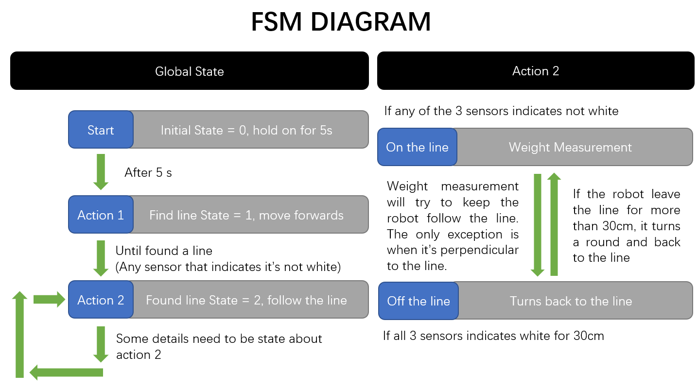
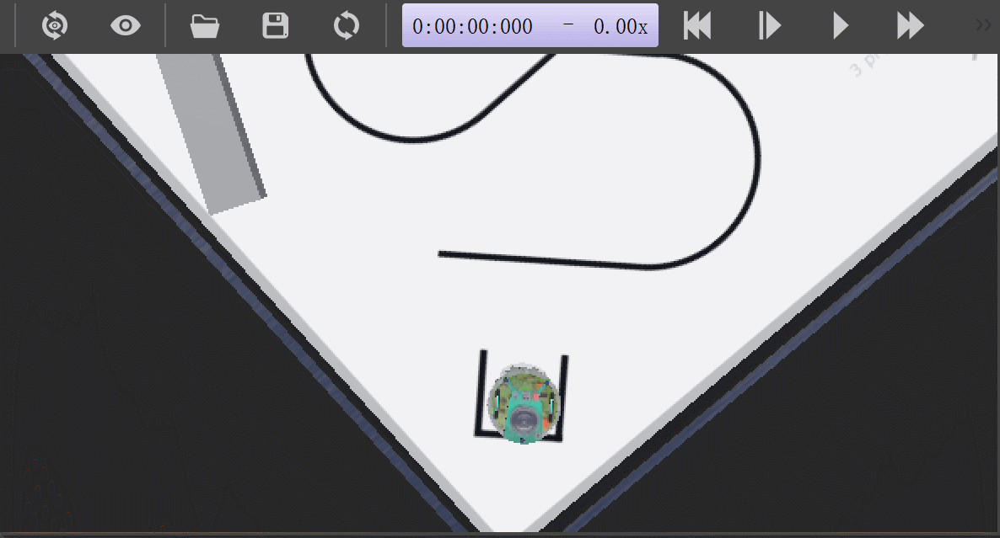

#! https://zhuanlan.zhihu.com/p/419237739
# Lec3. Finite State Machine (Updating)

## Lab

>为了使程序的结构更加清晰，本章开始将使用 `C++` 和 `cmake` 来编写程序。在大致浏览过 [labsheet3](https://colab.research.google.com/github/paulodowd/EMATM0053_21_22/blob/main/WLabsheets/L3_FiniteStateMachine.ipynb) 后我发现本章所提供的思路在 `lab2` 的代码中已经有所尝试。因此，本章的重点在于变更语言和优化代码。

### Make it in C++

有关 `webots` `C++` 编程的官方文档可以查看下方链接:

- [C++ Setup](https://cyberbotics.com/doc/guide/using-c#c-cpp-compiler-installation)
- [Programming Examples](https://cyberbotics.com/doc/guide/controller-programming?tab-language=c++)
- [C++/JAVA/Python](https://cyberbotics.com/doc/guide/cpp-java-python#controller-class)
- [Supervisor Programming](https://cyberbotics.com/doc/guide/supervisor-programming)
- [Using Numerical Optimization Methods](https://cyberbotics.com/doc/guide/using-numerical-optimization-methods)

>目前在 `Cmake`  上遭遇了不小的问题，所以 `cpp` 可能又要鸽了。

## Exercise 1: Planning a FSM

1. Draw a FSM for the above states.
  - Annotate your FSM to include the information required for each transition.
  - Make notes on your FSM to about pieces of code or techniques that you have developed which will be relevant.
  - Consider how the FSM could be expanded to include other desired functionality.  What information is required to inform new states and new transitions?

2. Review your existing code:
  - Where necessary, `refactor` your code into functions.  These will be easier to integrate with the FSM.
  - Ensure you test all modifications to your code.  

## Exercise 2: Implementing a FSM

The following code extract provides a suggested method to implement a Finite State Machine.

1. **Decompose the problem**: Implement one new state at a time, and ensure it operates as expected. 
  - Test for a transition into and out of the state.  
  - Build each new state progressively, one after the other.  
  - Test the robot performs in a repeatable manner.  

> See code at [labsheet_3.c](https://github.com/Alexbeast-CN/Uob_Robotics/blob/main/Robotics%20Systems/labsheet_3/labsheet_3.c)