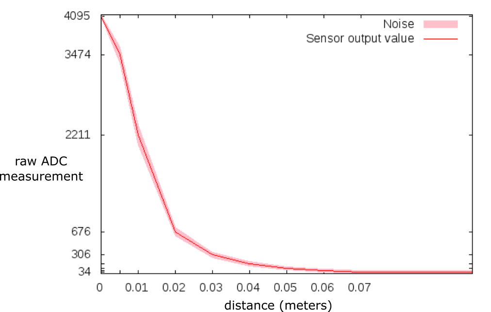
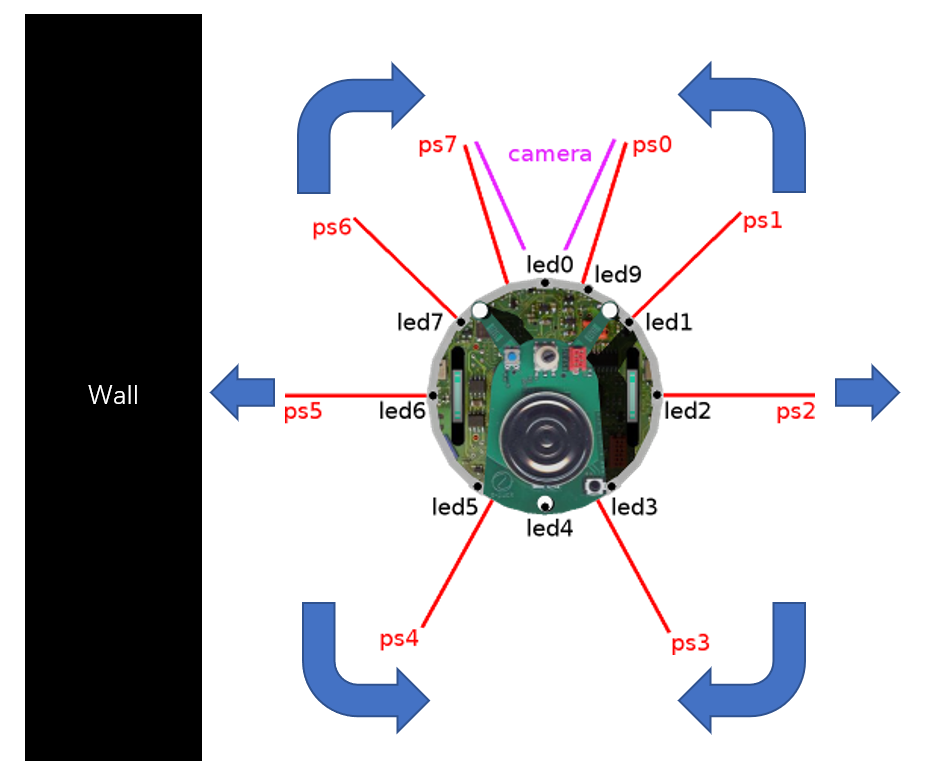
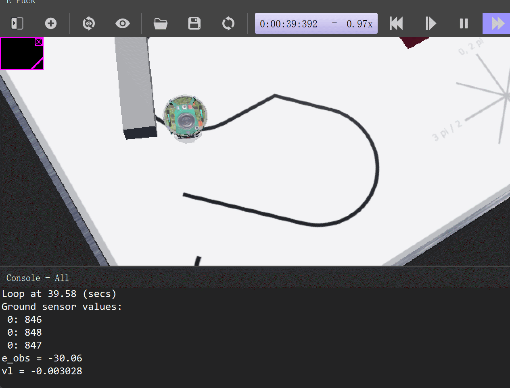

#! https://zhuanlan.zhihu.com/p/423815444
# Lec4. Obstacle Avoidance(updating)

> 很抱歉这部分的内容我将不再知乎内提供代码文件的链接了。由于吸取`Lec3`文章失败的经验，我发现直接放代码有背于 `Document` 的本质，所以本篇文章更多的我会以文字的形式描述功能的实现，以及我在实现过程中做的尝试。

## Lab

这部分内容是，我们的模拟机器人需要检测此块并安全地绕过它，重新加入线路并继续跟随线路。为了实现这个内容，需要进入 `e-puck` 自带的接近传感器。如下图所示，我们的机器人从 ps0 - ps7 共有8个接近传感器，传感器的特性如下：
- 传感器响应为非线性
- 传感器响应是high在接近障碍物时。
- 传感器响应是low在远离障碍物时。
- 传感器的最大范围为7cm。   
- 测得的信号在大约 的值处趋于平坦，这是34一个偏移偏差。
- 测量信号中有一些噪声。


> 仔细观察可以发现，`e-puck`的传感器主要集中在前部，目的也很明显，方便避开前进过程中的障碍。而左右两侧的传感器对称放置，这就让我想起了之前的`weight measurement`方法，这次我们将左边的传感器(ps7, ps6, ps5, ps4)利用权重算法集合成为一个左传感器，右侧的(ps0, ps1, ps2, ps3)利用相同的算法集合成为一个右传感器。这样就可以直接套用之前的`weight measurement`算法来做本章的功能呢了。

### Exercise 1: E-Puck Model

1. If the maximum raw measurement from the `analog-to-digital` converter (ADC) is 4095, how many bits of resolution must the ADC be configured to?
  - why might this be a different resolution to the ground sensor?

> Ans:
> Not sure.

2. Would you regard this sensor as:
  - `precise`?
  - `accurate`?

> Ans:
> Precise

3. The shape of the `sensor response` is `non-linear`, and this has implications for the robot's ability to perceive the environment:
  - measurements below the approximate value of 306 on the y-axis suffer from **`perceptual aliaising`** - what does this mean?

> Ans:
> Preceptual aliasing usually happens in robotic mapping. Perceptual aliasing is the phenomenon where different places generate a similar visual (or, in general, perceptual) footprint. 

4. How could you normalise a sensor reading measurement to be within the range [ 0.0 : 1.0 ]?
  - why might this be useful to do?

> Ans:
> Using the measurement value over the range to normalize.

5. What steps might you take to convert the y-axis values into units of distance?
  - in what scenario or task would this unit conversion be useful?
  - is this necessary for a `reactive` obstacle avoidance controller?

> Ans:
> I will only use sensor PS7 and PS0 to do the task of converting the y-axis values into distance. It would be helpfule when the obstacle's surface is Perpendicular to the robot's trajetory. It's necessary.

6. What characteristic of the `sensor response` could be used to give a measure of confidence to a given sensor reading?
  - within the context of obstacle avoidance, what does the term `confidence` refer to?

### Exercise 2: Obstacle 

> 这个 Exercise 2 实际上是对于实现避障行为的引导，老师写的这个引导还是很多意义的，所以直接粘过来了。这部分的内容我不会进行修改，但是我会在 `Test` 节提供我实现流程。

Depending on your implementation you could either:
 - have obstacle avoidance always active, but not not always contributing to motion (e.g., in the ANN implementation above, it is possible to have a configuration of the network that provides 0 contribution when no sensors are active).
 - have obstacle avoidance activated only when necessary.  In this method, you would need to add a simple check on your proximity sensors to decide whether obstacle avoidance is necessary.


1. Before you start writing code consider:
  - how could obstacle avoidance behaviour be achieved with a bang-bang controller?
  - what advantages or disadvantages might there to a bang-bang controller?
 
2. Decide a threshold value from the `sensor response curve` for when an `obstacle avoidance behaviour` should be activated.  
  - **Note:** the proximity sensors always report a value, even when there is not an obstruction. 
  - write a function to check all proximity sensors and return an appropriate value if obstacle avoidance is required.
  - check that this function operates reliably.
  - utilise the result of this function to either:
    - transition your FSM into/out-of obstacle avoidance appropriately (preferred)
    - activate obstacle avoidance execution flow in your program

3. Start by creating a weight of 0 for all sensors.  With just the two foward proximity sensors, find weight values to effect a turning behaviour in the approriate direction:
  - which two proximity senors are the most forward facing?
  - how might you pre-process your proximity sensor measurements to make subsequent calculations easier?
  - **help:** to begin with, do not have your robot move forward or backward, only turn on the spot.  
  - **help:** remember that you can position your robot within the environment by clicking on it.
  - **help:** avoid **`blocking code`** - for exmaple, your obstacle avoidance function should return and be called again by `loop()` even while there is an obstruction.
  - what would be a desirable value of `e_obs` if both forward sensors report identical values, or cancel each other out?  Implement a bias in your gain values to solve this issue.  
    - **Hypothesise:** in what environment circumstances would the robot be in where both sensors report the same value?
  - **Validate:** using just the two forward sensors, how far does your robot rotate away from the obstruction?  Would this enough to transit without collision?
  - **help**: the following code extract follows a similar format to line following:


## Test

### 1. 熟悉 `ps` 传感器

在一个空的模板里写入函数：

> 当然为了让函数可以实现，我们还需要激活 `ps` 传感器，就像例子中激活 `gs` 传感器那样。

```c
void get_value()
{
  int i;

  for( i = 0; i < NB_PS; i++ ) {

      // read value from sensor
      ps_value[i] =  wb_distance_sensor_get_value(ps[i]);
      printf("%.2f ",ps_value[i]);

  }
  printf("\n");
}
```

然后在测试的时候可以看到，当机器人周围没有东西的时候，传感器的值也会受到干扰而出现一个随机的范围值 （64 - 70）。而当机器人贴近墙面的时候这个值会变大，我测得的最大值为 `1700`。实际上根据老师提供的表，数据应该符合下图（一个非线性的曲线）。但这样的非线性是不好的，尤其是从0.02 到 0.04 之间的突变。所以为了简化模型，我只取 0.04 到 0.07的这一段。



### 2. `Weight Measurement` 算法测试

老师为我们提供了一个算法，如下：

```c
  int i;
  // Same number of weigths as sensors
  float weights[NB_PS] = { 0.1, 0.2, 0.4, 0.5, -0.5, -0.4, -0.2, -0.1};
  float e_obs;

  // Set initial value.
  e_obs = 0.0;
  for( i = 0; i < NB_PS; i++ ) {

      // read value from sensor
      ps_value[i] =  wb_distance_sensor_get_value(ps[i]);
      // Simple summation of weighted sensor values.
      e_obs = e_obs + ( ps_value[i] * weights[i] );
  }
```

这个算法依然是 `weight measurement` 的那套思路，其中有一点我很疑惑，在对每一个传感器加权的时候，`ps0` 只占有了 `0.1`，后方的传感器居然有 `0.5`。这使机器人在面对前方障碍物时表现很不敏感，于是我做了一些调整，写出了以下函数：

```c
float dis_error()
{
  int i;
  // Same number of weigths as sensors
  float weights[NB_PS] = { 0.5, 0.4, 0.2, 0.1, -0.1, -0.2, -0.4, -0.5};
  float e_obs;

  // Set initial value.
  e_obs = 0.0;
  for( i = 0; i < NB_PS; i++ ) {

      // read value from sensor
      ps_value[i] =  wb_distance_sensor_get_value(ps[i]);
      // Simple summation of weighted sensor values.
      e_obs = e_obs + ( ps_value[i] * weights[i] );
  }
  return e_obs;
}
```

经过调整后，可以测得在没有障碍物的时候，`e_obs`大约为(-5,5)，而有障碍的情况下，`e_obs`会呈现与之前曲线类似的趋势。绝对值范围大约在(50,1200)。那么，有了`e_obs`后，我打算直接利用`e_obs`做转动速度的参数。但其实这里还是有一些草率的，因为`e_obs`的非线性，可能会导致机器人的转动速度超过阈值。最佳的策略应该对`e_obs`做`nomalize`和线性化处理，求出实际距离。但既然处于测试阶段，就先尝试最简单的方法。于是有了下面的函数。

```c
void avoid_obs(float e_obs)
{
  // Use Weight Measurement to follow line
  // Determine a proportional rotation speed
  float turn_velocity;
  turn_velocity = 0.1;  // What is a sensible maximum speed?
  turn_velocity = turn_velocity * e_obs;
  printf("%2f",turn_velocity);

  // Set motor values.
  wb_motor_set_velocity(right_motor, Max_speed + turn_velocity);
  wb_motor_set_velocity(left_motor, Max_speed - turn_velocity);
}
```


从视频可以看出来，机器人避障的基本功能已经实现了，但存在几个问题：

- 机器人似乎有点敏感，一点干扰就会让他左右摇头。
- 在快遇到墙壁的时候，`e_obs`太大了，以至于超过了机器人的速度上限，而报错

### 3. 实际应用

> 首先要清楚的一点是，这个算法最终的效果。我们需要让机器人遇到线上障碍物的时候可以贴着障碍物前进，直到机器人再次回到线上。对于整个系统而言，避障算法是独立于巡线之外的另外一个 `STATE`，本章的任务就是把这个 `STATE` 写好。


#### 3-1 算法逻辑

>此部分内容全当抛砖引玉，虽然达成了功能，但使用的方法实在不优雅。若读者有更好的方法欢迎与我讨论。

机器人进入障碍物模式时存在 3 种情况：
- 障碍物在左边
- 障碍物在右边
- 与障碍物垂直

在开始讨论之前，我们需要确定一个障碍物阈值 `OBS`，即机器人 `ps` 超过多少算遇到障碍物。这需要自己测试，调参。

首先讨论最特殊的，与障碍物垂直的情况。如果垂直于障碍物，即 `ps0 = ps1 > OBS` ，则机器人直接右转。此后便进入障碍物在右侧模式。

若障碍物在右侧，即 `e_obs > OBS`，则利用 `Weight Measurement` 来保证 `e_obs` 在阈值 `OBS_E` 附近，即保证机器人始终贴着障碍物前进。

若障碍物在左侧，即 `e_obs < -OBS`，则利用 `Weight Measurement` 来保证 `e_obs` 在阈值 `-OBS_E` 附近，即保证机器人始终贴着障碍物前进。

在避障模式下，状态一直返回至避障模式，直到遇到黑线，退出避障模式，进入巡线模式。

#### 3-2 算法测试思路

> 个人认为这个算法中最关键的参数，是对每个传感器权重的设计。

各个传感器所提供的功能如下：




1. 不添加前进速度，保证机器人无论什么角度（锐角）遇到障碍物都要转到与障碍物面平行的方向。
2. 当达到障碍物转角后还没有遇到黑线，则需要绕过障碍物，需要用到小车后方的传感器提供转向力。这部分的测试需要达到的状态是：小车可以绕某个障碍物一直绕圈。



最后只需要将刚刚写好的函数接口插入主程序就可以了。


### 4. 算法优化

> 优化的目的是为了使机器人变得更加鲁棒（Robust)，虽然我的机器人已经可以实现上面的算法了，但是依然存在不鲁棒的地方。但是优化是无止尽的，对于我来说，达成功能就可以了。

优化思路：

- 调参
- 算法中变量形式的修改

### 5. 巡线补充

> 在巡线部分，老师的算法去除了中间传感器对于计算的影响，这样会倒是机器人在黑线上，却读不到黑线的数值。而出现以下奇奇怪怪的问题。那么如何修改代码，从而使用到中间的 `gs[1]` 传感器是一个需要解决问题。
