#! https://zhuanlan.zhihu.com/p/423386635
# Lec2. 齐次矩阵(Homogeneous Transformations) - 1

> 还是大致的看了一下Aghil Jafari教授的课程，真的让人受不了啊，这英语真的让人难以理解。所以还是弃暗投明，选择coursera上台大林沛群老师的[机器人学课程](https://www.coursera.org/learn/robotics1/home/welcome)

## 1. 刚体运动状态的描述

由于我们主要学习空间中的刚体运动，因此直接来看3D：

一般我们有3个方向(x,y,z轴)上的平移和3个方向(x,y,z轴)上的转动。共6个自由度（6DOF）。这六个自由度描述了物体在空间中姿态，如果想要描述物体的运动，只需要对物体的位移和姿态进行微分，便可以得到物体的速度和加速度等运动状态。

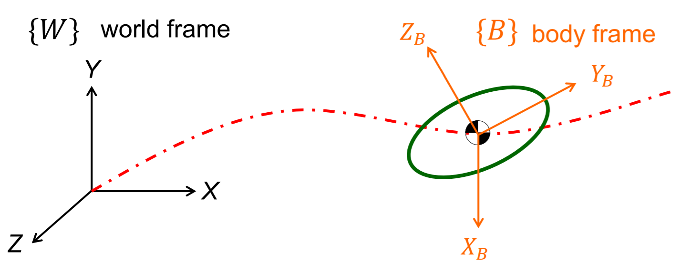

### 1.1 刚体的移动

我们用向量（Vector）$\vec{p}$ 来描述 Frame B 相对于 Frame A 的移动。

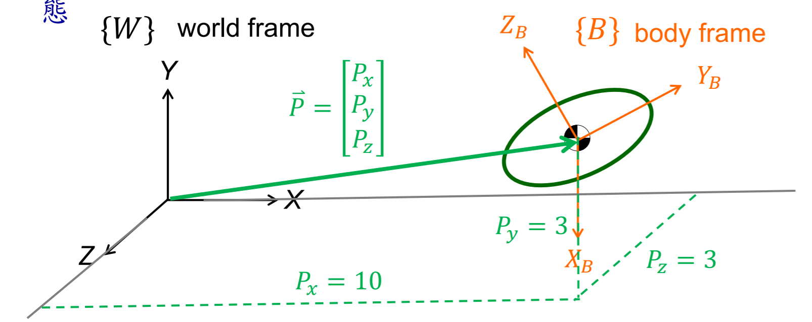

比如在上面的例子中，位移向量 $\vec{p}$ 为：

$$\vec{p} = 
\left[
\begin{matrix}
P_x\\P_y\\P_z
\end{matrix}
\right]=
\left[
\begin{matrix}
10\\3\\3\\
\end{matrix}
\right]=
^{A}p_{B org}$$

### 1.2 刚体的转动

PPT 中的这张图很清楚的说明了如何利用转动矩阵来描述，Frame B 相对于 Frame A 转动的状态。我们利用一个 3X3 的矩阵来表示转动。矩阵的每一个列，代表一个轴的转动向量。矩阵用 $^{A}_{B}R$ 来表示，其中上标 `A` 为 `base` 基坐标，下坐 `B` 为 `Target`目标坐标。
 
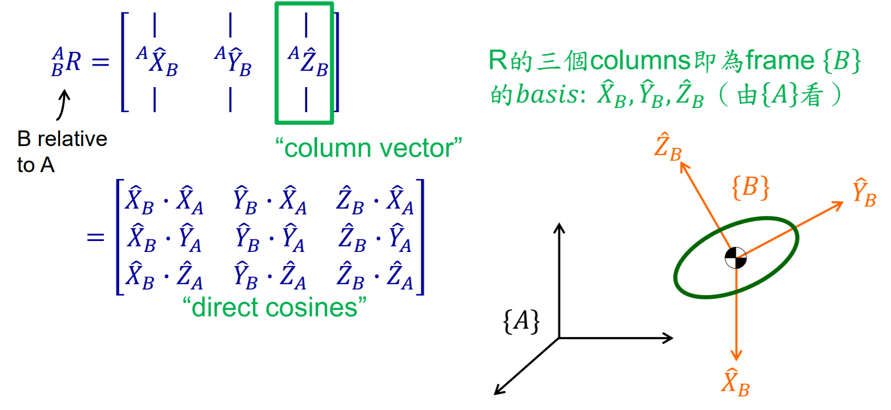

每一个列向量实则为 `B` 中的基向量$\vec{x},\vec{y},\vec{z}$ 在 `A` 上的投影。比如下面的例题： 

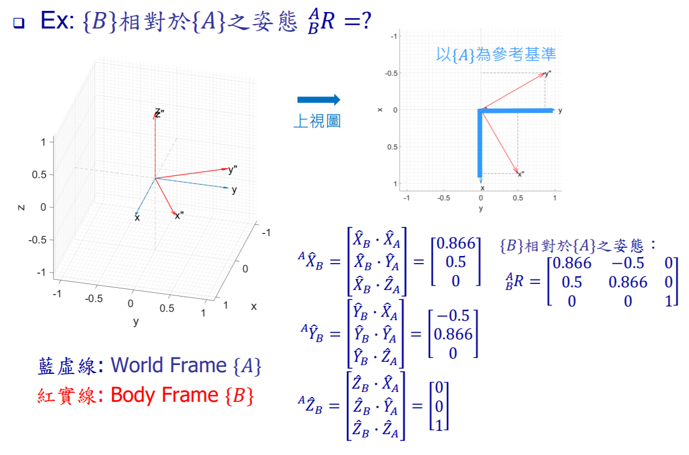

### 1.3 旋转矩阵

**特性：**

- <center>矩阵列向量长度为1</center>
- <center>列向量之间两两垂直</center>
- $$^{A}_{B}R = ^{B}_{A}R^T = ^{B}_{A}R^{-1}$$
- $$^{A}_{B}R ^{B}_{A}R^T = I_3$$
- $$Det(R) = 1$$
- $$Det(R^{T}) = -1$$

旋转矩阵除了表述 Frame 之间的姿态关系外，也可以用于转换向量之间的坐标。

$$^{A}P = ^{A}_{B}R^{B}P$$

> 一定注意，是左乘旋转矩阵！

**计算方法：**

对于Frame A 到 Frame B 的旋转矩阵 R：

$$_{B}^{A}R = 
    \left[
    \begin{matrix}
        |&|&|\\
        ^{A}\hat{X}_B&^{A}\hat{Y}_B&^{A}\hat{Z}_B\\
        |&|&|\\
    \end{matrix}
    \right]$$

- 绕 Z 轴旋转：
    $$R_z(\theta)=
    \left[
    \begin{matrix}
        cos\theta & -sin\theta & 0\\
        sin\theta & cos\theta & 0\\
        0 & 0 & 1
    \end{matrix}
    \right]=
     \left[
    \begin{matrix}
        c\theta & -s\theta & 0\\
        s\theta & c\theta & 0\\
        0 & 0 & 1
    \end{matrix}
    \right]$$

- 绕 X 轴旋转：
    $$R_x(\theta)=
    \left[
    \begin{matrix}
        1&0&0\\
        0&cos\theta&-sin\theta\\
        0&sin\theta&cos\theta\\
    \end{matrix}
    \right]=
     \left[
    \begin{matrix}
        1&0&0\\
        0&c\theta&-s\theta\\
        0&s\theta&c\theta\\
    \end{matrix}
    \right]$$

- 绕 Y 轴旋转：
    $$R_y(\theta)=
    \left[
    \begin{matrix}
        cos\theta&0&sin\theta\\
        0&1&0\\
        -sin\theta&0&cos\theta\\
    \end{matrix}
    \right]=
     \left[
    \begin{matrix}
        c\theta&0&s\theta\\
        0&1&0\\
        -s\theta&0&c\theta\\
    \end{matrix}
    \right]$$

> 逆时针的旋转方向为正

> 在 Matlab 2021b 及以上版本中可以使用 rotx(), roty(), rotz() 来计算旋转矩阵。

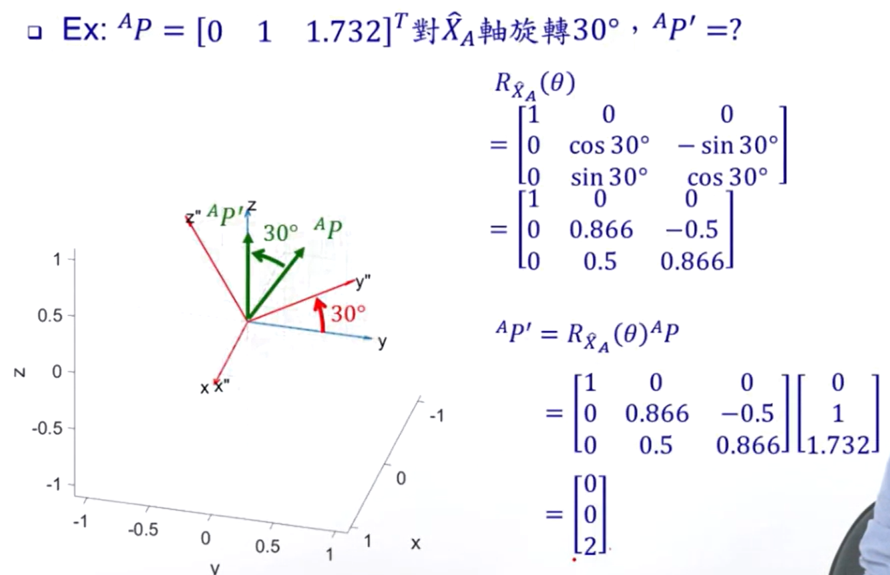

以上例题，在 `Matlab Online` 中就可以使用以下代码来求解：

```Matlab
P = [0;1;1.732]
R = rotx(30)
Pnew = R*P
```

Output:
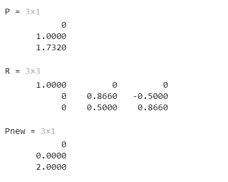

### 1.4 旋转矩阵与转角
 
将旋转矩阵拆解成对(x,y,z)轴的转角一本来说有2种方法：
- 对框架固定不动的转轴旋转:固定角(Fixed angles)
- 对当前时刻框架的转轴旋转：欧拉角(Euler angles)

#### 1.4.1 Fixed Angles

分别对于最初的框架$X_A, Y_A, Z_A$旋转 $\gamma, \beta, \alpha$，可以算出一个合成的旋转矩阵：

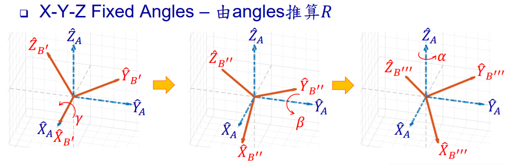

$$^{A}_{B}R_{X,Y,Z}(\alpha,\beta,\gamma) = R_Z(\gamma)R_Y(\beta)R_X(\alpha)$$

$$^{A}_{B}R_{X,Y,Z}(\alpha,\beta,\gamma) = 
\left[
    \begin{matrix}
    c\alpha c\beta&c\alpha s\beta s\gamma - s\alpha c\gamma&
    c\alpha s\beta c\gamma + s\alpha s \gamma\\
    s\alpha c\beta&s\alpha s\beta s\gamma+c\alpha c\gamma&s\alpha s\beta c\gamma - c\alpha s\gamma\\
    -s\beta&c\beta s\gamma&c\beta c\gamma
    \end{matrix}
\right] = 
\left[
    \begin{matrix}
    r_{11}&r_{12}&r_{13}\\
    r_{21}&r_{22}&r_{33}\\
    r_{31}&r_{32}&r_{33}\\
    \end{matrix}
\right]$$


> 注意这里的顺序是先转的放后面

假如改变转动轴的顺序，则输出的答案与预期会不一样：

在`matlab online`完成先对`x`轴转动30°，再对`y`轴转动60°。与先对`y`轴转动60°，再对`x`轴转动30°:

```matlab
Rx = rotx(30)
Ry = roty(60)

R1 = Ry*Rx
R2 = Rx*Ry
```

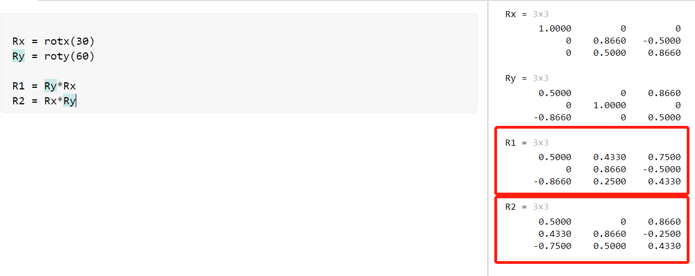

> 学过线代的都知道，矩阵的左乘和右乘有区别，因此输出结果不一样。

现在由旋转矩阵`R`反向推到旋转角度：

> 非常可惜，由于 Fixed Angles 并不是常用的方法，所以 Matlab 种没有预设的函数。

由：

$$^{A}_{B}R_{X,Y,Z}(\alpha,\beta,\gamma) = 
\left[
    \begin{matrix}
    c\alpha c\beta&c\alpha s\beta s\gamma - s\alpha c\gamma&
    c\alpha s\beta c\gamma + s\alpha s \gamma\\
    s\alpha c\beta&s\alpha s\beta s\gamma+c\alpha c\gamma&s\alpha s\beta c\gamma - c\alpha s\gamma\\
    -s\beta&c\beta s\gamma&c\beta c\gamma
    \end{matrix}
\right] = 
\left[
    \begin{matrix}
    r_{11}&r_{12}&r_{13}\\
    r_{21}&r_{22}&r_{33}\\
    r_{31}&r_{32}&r_{33}\\
    \end{matrix}
\right]$$

可以得：

$$\begin{aligned}    
&if \beta \neq 90\degree\\
&\beta = Atan2(-r_{31},\sqrt{r_{11}^2+r_{21}^2})\\
&\alpha = Atan2(r_{21}/c\beta,r_{11}/c\beta)\\
&\gamma = Atan2(r_{32}/c\beta,r_{33}/c\beta)
\end{aligned}$$

对于特殊情况：

$$\begin{aligned}    
&If \beta = 90°\\
&\alpha = 0°\\
&\gamma = 𝐴𝑡𝑎𝑛2(𝑟12, 𝑟22)
\end{aligned}$$

$$\begin{aligned}    
&If \beta = -90°\\
&\alpha = 0°\\
&\gamma = -𝐴𝑡𝑎𝑛2(𝑟12, 𝑟22)
\end{aligned}$$

用 matlab 实现：

```matlab
Rx = rotx(30)
Ry = roty(60)

R = Ry*Rx

y = rad2deg((atan2(-R(3,1),sqrt(R(1,1)^2+R(2,1)^2))))
z = rad2deg((atan2(R(2,1)/cos(deg2rad(y)),R(1,1)/cos(deg2rad(y)))))
x = rad2deg((atan2(R(3,2)/cos(deg2rad(y)),R(3,3)/cos(deg2rad(y)))))
```

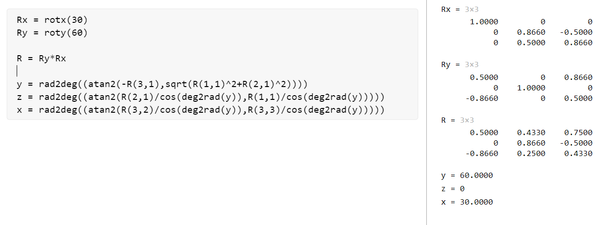

#### 1.4.2 Euler Angles

`Euler Angles` 相对 `Fixed angles` 要常用一点，而且有$C_3^3C_3^2C_3^2=12$种旋转方法，其中比较常用的有 `ZYX` 和 `ZYZ`。

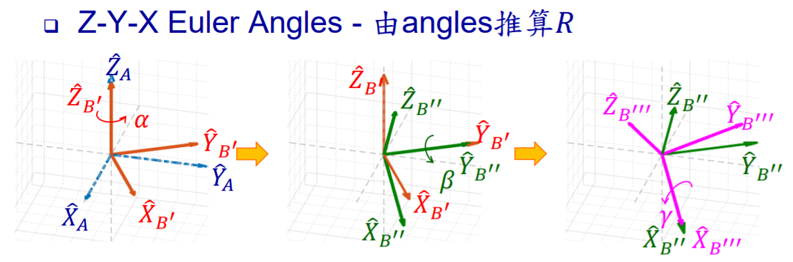
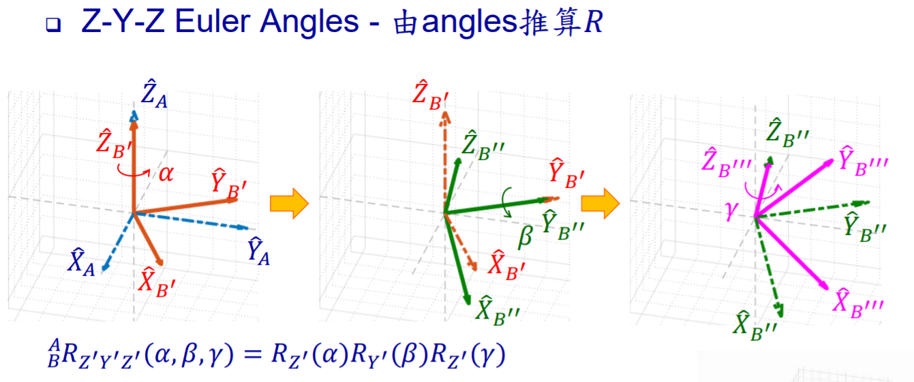


对于欧拉角来说，计算旋转矩阵的方式不一样了。原来先转后乘，变成了先转先乘：

$$^{A}_{B}R_{Z',Y',X'}(\alpha,\beta,\gamma) = R_{Z'}(\gamma)R_{Y'}(\beta)R_{X'}(\alpha)$$
$$^{A}_{B}R_{Z',Y',Z'}(\alpha,\beta,\gamma) = R_{Z'}(\gamma)R_{Y'}(\beta)R_{Z'}(\alpha)$$

>这种方法看起来就像 `fixed angles` 的反向旋转。

但同样，旋转顺序对于旋转矩阵来说非常重要。

由旋转矩阵`R`反向推到旋转角度：

在`Matlab`中可以使用：

```matlab
eul = rotm2eul(rotm)
eul = rotm2eul(rotm,sequence)
```

> function refence: https://cn.mathworks.com/help/robotics/ref/rotm2eul.html

例子：

```matlab
Rx = rotx(30)
Ry = roty(60)

R = Ry*Rx

ZYX = rad2deg(rotm2eul(R,"ZYX"))
ZYZ = rad2deg(rotm2eul(R,"ZYZ"))
```

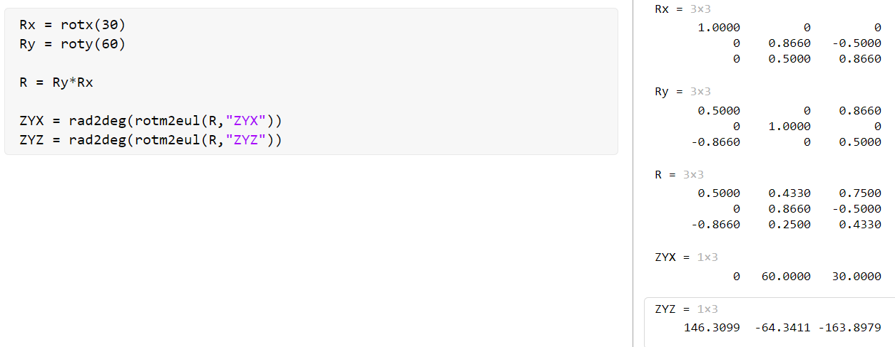

>一般来说，两个方法算出来的值是应该不同的。但其中 `ZYX` 的值与 `Fixed Angles` 的值相同。


下篇：[Homogeneous Transformations - 2](https://zhuanlan.zhihu.com/p/426121325)
