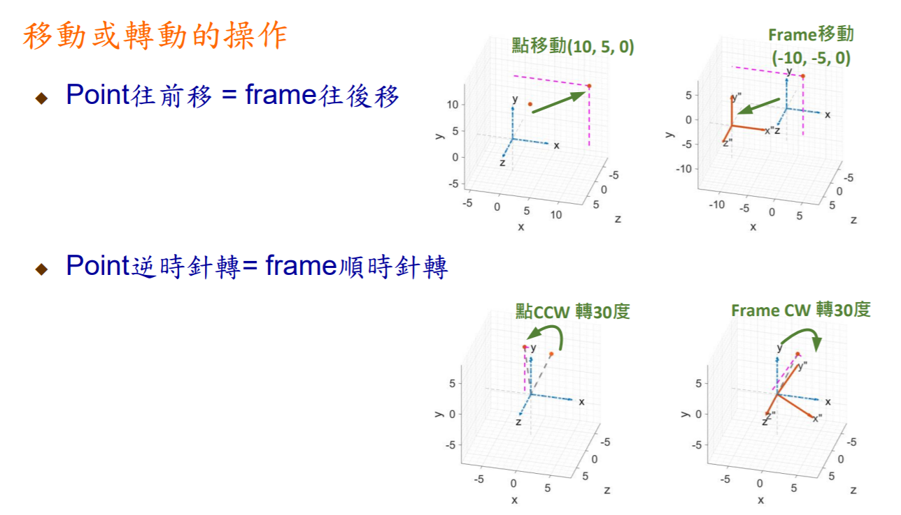
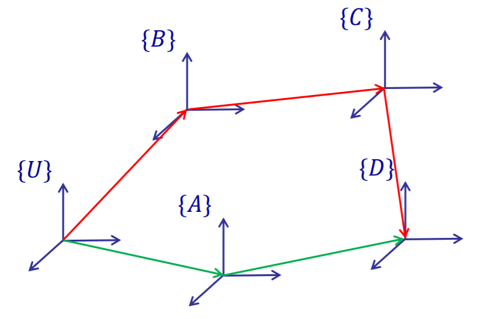

#! https://zhuanlan.zhihu.com/p/426121325
# Lec2. 齐次矩阵(Homogeneous Transformations) - 2

## 1.5 Mapping

通过之前的学习，我们知道了刚体的质心状态可以通过坐标轴 (frame) 上的点来表示。而坐标点的变换由可以分解为旋转和平移两种运动方式。

平移：

$$^{A}R_{B org} = \left[
    \begin{matrix}
        P_{B x} \\
        P_{B y} \\
        P_{B z} \\
    \end{matrix}
\right]$$

{B} frame 对 {A} frame 的平移

转动：

$$_{B}^{A}R = 
\left[
\begin{matrix}
    |&|&|\\
    ^{A}\hat{X}_B&^{A}\hat{Y}_B&^{A}\hat{Z}_B\\
    |&|&|\\
\end{matrix}
\right]$$

整合后：

$$\left\{
    B
\right\}=
\left\{
    ^{A}_{B}R, ^{A}P_{B org}
\right\}$$

考虑到将两者整合为同一个矩阵后的运算方便性，对其使用增广，从而产生一个 (4x4) 的齐次矩阵。

Homogeneous transformation matrix:

$$\left[
    \begin{matrix}
        ^{A}_{B}R \  _{3\times3} & ^{A}P_{B org} \ _{3\times1}\\
        0\ 0\ 0 & 1\\
    \end{matrix}
\right]=
\left[
    \begin{matrix}
        |&|&|&|\\
        ^{A}\hat{X}_B&^{A}\hat{Y}_B&^{A}\hat{Z}_B&^{A}P_{B org}\\
        |&|&|&|\\
        0&0&0&1\\
    \end{matrix}
\right]=
^{A}_{B}T$$

## 1.6 Operators

有了 Transformation Matrix, T 后， 我们就可以使用一个矩阵来表示坐标轴之间的变换了。如下图，当我们知道向量 $P$ 对于 frame {A} 的向量为 $^{A}P$ 和{A} 到 {B} 的变换方式后，便可以求出 $P$ 再 frame {B} 中的向量 {^{B}P}。


- 仅有移动时：

$$^{A}P\ _{3\times1} = ^{B}P\ _{3\times1} + ^{A}P_{B org}\ _{3\times1}$$

即简单的向量相加。其齐次矩阵形式为：

$$\left[
    \begin{matrix}
        ^{A}P \\
        1\\
    \end{matrix}
\right]=
\left[
    \begin{matrix}
        I_{3\times3}&^{A}P_{B org}\ _{3\times1}\\
        0\quad 0\quad 0& 1\\
    \end{matrix}
\right]
\left[
    \begin{matrix}
        ^{B}P \\
        1\\
    \end{matrix}
\right]=
\left[
    \begin{matrix}
        ^{B}P + ^{A}P_{B org} \\
        1\\
    \end{matrix}
\right]$$

- 仅有旋转时：

$$^{A}P\ _{3\times1} = ^{A}_{B}R_{3\times3} \ ^{B}P\ _{3\times1} $$

> 注意：是左乘

$$\left[
    \begin{matrix}
        ^{A}P \\
        1\\
    \end{matrix}
\right]=
\left[
    \begin{matrix}
        ^{A}_{B}R_{3\times3}&\begin{matrix}
            0\\0\\0
        \end{matrix}\\
        0\quad 0\quad 0& 1\\
    \end{matrix}
\right]
\left[
    \begin{matrix}
        ^{B}P \\
        1\\
    \end{matrix}
\right]=
\left[
    \begin{matrix}
        ^{A}_{B}R_{3\times3} \ ^{B}P\ _{3\times1} \\
        1\\
    \end{matrix}
\right]$$

- 当移动和旋转复合时：

$$^{A}P\ _{3\times1} = ^{A}_{B}R_{3\times3} \ ^{B}P\ _{3\times1} + ^{A}P_{B org}\ _{3\times1}$$

> 注意我们一般先让其旋转，后平移。

$$\left[
    \begin{matrix}
        ^{A}P \\
        1\\
    \end{matrix}
\right]=
\left[
    \begin{matrix}
        ^{A}_{B}R_{3\times3}&^{A}P_{B org}\ _{3\times1}\\
        0\quad 0\quad 0& 1\\
    \end{matrix}
\right]
\left[
    \begin{matrix}
        ^{B}P \\
        1\\
    \end{matrix}
\right]=
\left[
    \begin{matrix}
        ^{A}_{B}R \ ^{B}P + ^{A}P_{B org}\ \\
        1\\
    \end{matrix}
\right]$$

例题1：


使用 `MATLAB ONLINE` 进行运算：

```matlab
PB = [3;7;0;1];
PAB = [10;5;0];
XAB = [sqrt(3)/2;1/2;0];
YAB = [-1/2;sqrt(3)/2;0];
ZAB = [0;0;1];

RAB = [XAB YAB ZAB]
TAB = [RAB PAB;0 0 0 1]
PA = TAB*PB
```


> 但是一定要注意，我们计算变换矩阵 `T` 都是基于先旋转后平移的方法。如果先平移后转动就会出现不一样的结果。

- 先旋转后平移：
$$P_{2} = R \ P_{1}\ + ^{A}Q$$

- 先平移后转动：


矩阵形式为：

$$P_2 =
\left[
    \begin{matrix}
        R(\theta)&\begin{matrix}
            0\\0\\0
        \end{matrix}\\
        0\quad 0\quad 0& 1\\
    \end{matrix}
\right]
\left[
    \begin{matrix}
        I_{3\times3}&^{A}Q\\
        0\quad 0\quad 0& 1\\
    \end{matrix}
\right]$$

因为运动是相对的，$^{A}_{B}𝑇$当Operator时对向量（或点）进行移动或转动的操作，也可以想成是对frame进行「反向」的移动或转动的操作。




## 1.7 Transformation Matrix 运算

### 1.7.1 连续运算

在之前的例子中，我们学会了 `frame` 从一个位置运动到另外一个位置的变换方程计算方法。那么利用齐次矩阵的性质，我们便可以简单的对于连续运动的 `frame` 进行追踪。方法就是简单的矩阵相乘（注意是左乘）。


从 `frame` {A} 运动到 `frame` {C} 的过程可以写为：

$$^{A}_{C}T = ^{A}_{B}T\ ^{B}_{C}T$$

> tips： 变换矩阵的上标为 base frame, 下标为 target frame。即 $^{A}_{B}T$ 表示为从 {A} 到 {B} 的变换。

### 1.7.2 反矩阵

根据其次矩阵的性质：

$$ ^{A}_{B}T\ ^{B}_{A}T = ^{A}_{B}T\ ^{A}_{B}T^{-1} = I_{4\times4}$$

从几何角度理解，就是一个 `frame` 变换了 T 之后，再按照 T 的方式反过来运动一遍，结果又回到了原位。

$$ ^{B}_{A}T \ ^{A}_{B}T\ T_{frame}  = T_{frame}$$

> Tips:
> 在 `MATLAB ONLINE` 中可以使用 `inv(T)` 来表示 `T` 矩阵的逆

由此便可以引出一种特殊的计算方式：

当 `frame` 的运动是一个闭环 (loop closure) 的时候，我们在已知任意 `n-1` 段 `frame` 变换矩阵后，可以求出未知段的变换。



$$^{U}_{D}T = 
^{U}_{A}T \ ^{A}_{D}T = ^{U}_{B}T \ ^{B}_{C} \ ^{C}_{D}T$$

if ^{C}_{D}T unknown:

$$\begin{aligned}
^{C}_{D}T &= 
(^{U}_{B}T \ ^{B}_{C})^{-1} \  ^{U}_{A}T \ ^{A}_{D}T 
&= ^{C}_{U}T\ ^{U}_{D}T
\end{aligned}$$

> Tips: 
> - T 左乘的时候，上下标可以相消。
>   - $^{C}_{U}T\ ^{U}_{D}T = ^{C}_{D}T$

上篇：[Homogeneous Transformations - 1](https://zhuanlan.zhihu.com/p/423386635)

下篇：[Forward Kinematics](https://zhuanlan.zhihu.com/p/426994048)
