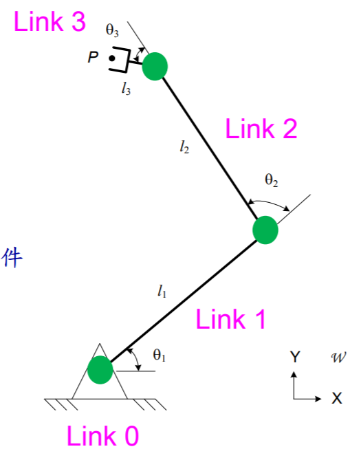
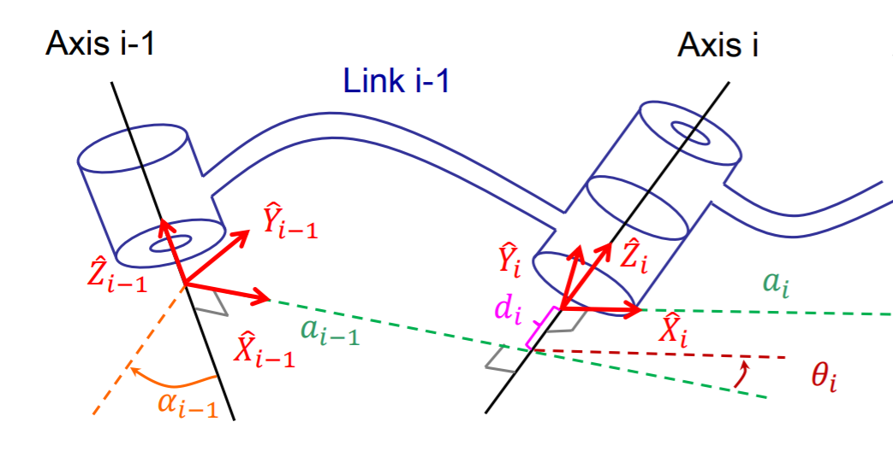
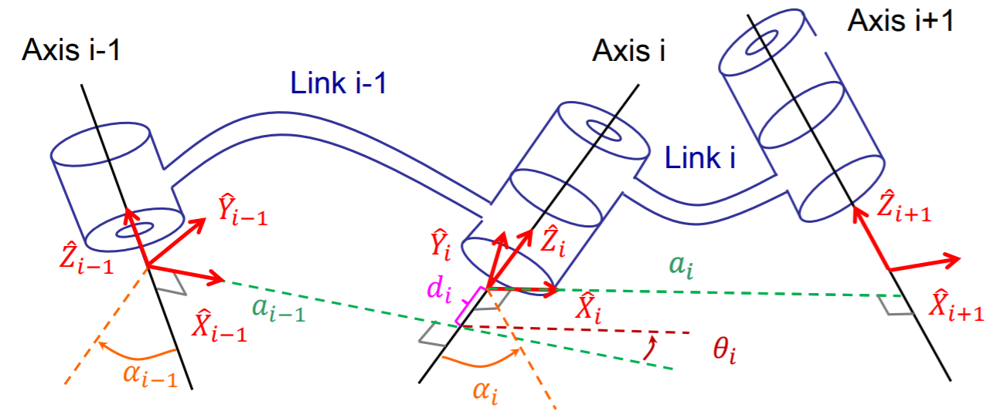
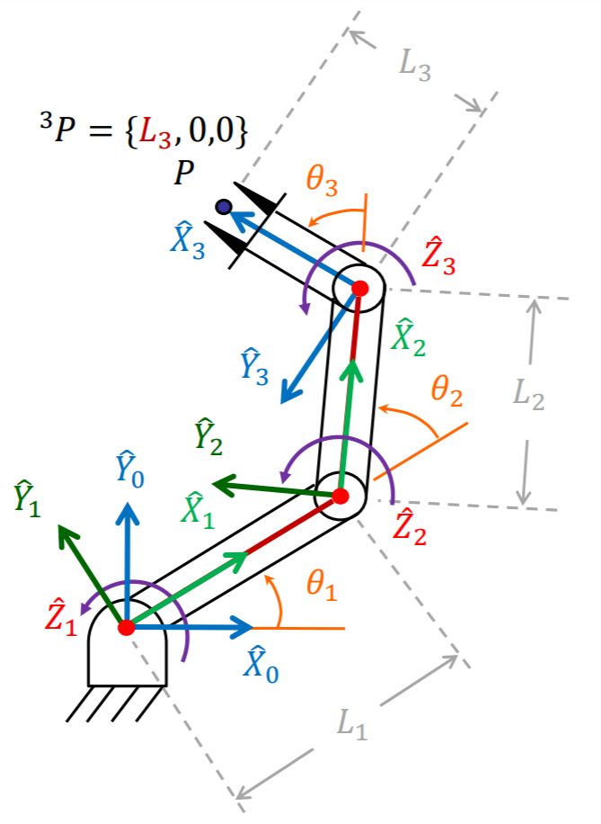
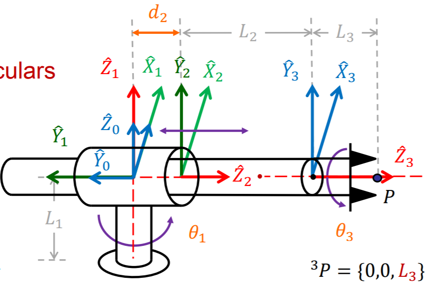
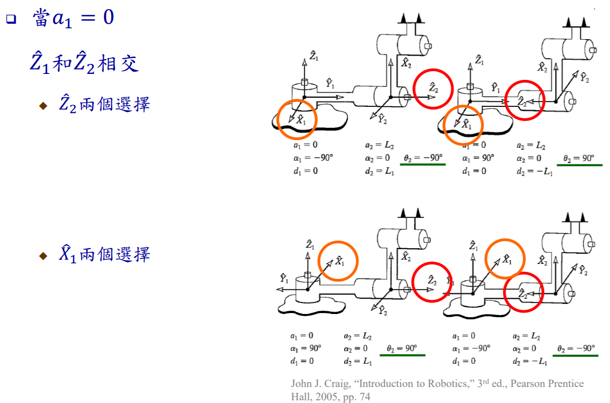
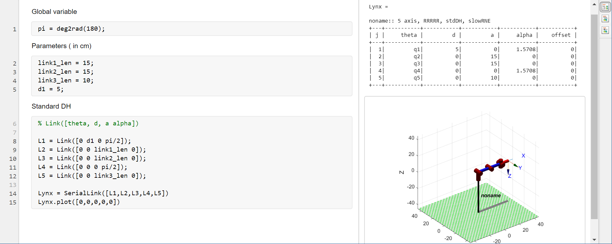
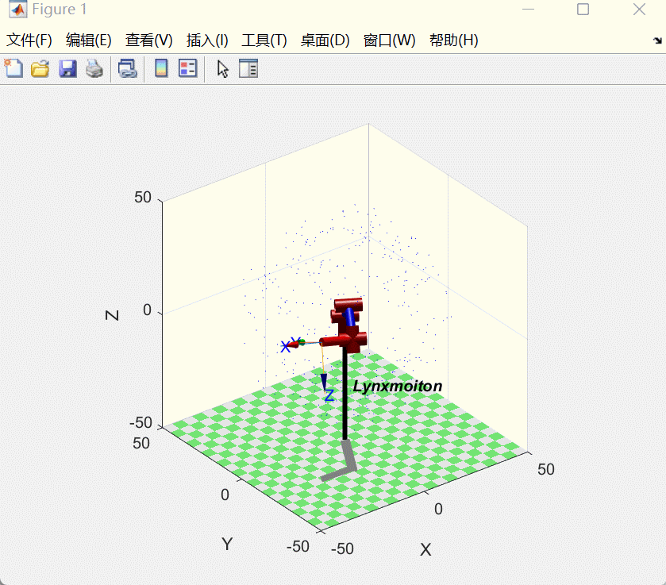

#! https://zhuanlan.zhihu.com/p/426994048
# Lec3. Forward Kinematics

> 很抱歉本篇文章中的表格在知乎中都无法显示，更好的观看体验可以移步到我的 [github](https://github.com/Alexbeast-CN/Uob_Robotics/blob/main/TaiDa/week3/lec3.md)

此处的正向运动学的对象是机械臂的运动状态。一个机械臂由多个连杆(Link) 和链接他们的关节(Joint) 组成。关节可以为机械臂产生移动和转动的运动，从而使得机械臂的末端到达指定的位置。让我们以这样的方式思考的时候，我们就在运用正向运动学了。

## 2.1 机械臂几何描述方式

机械臂的运动由两个关键元素组成：

- 关节(Joint):
    - 每一个旋转 (revolute) 或 平移 (prismatic) 的 joint 具有 1 DOF
    - 旋转轴和平移轴是固定不变的（这一点后面会详细讲解）

- 连杆(Link):
    - 这里所讨论的连杆均为刚体。
    - 编号方式为：
      - 地杆：link0
      - 与地杆向连的第一个连杆: link1
      - 第二个可运动的连杆: link2



我们在每一个 Joint 的位置创建 frame 用来描述机械内部结构的坐标变换。对于上图来说，就是在每一个绿点的位置创建 frame。这样我们就可以使用上一章学习的内容来描述机械臂的坐标变换了。

具体来说，对于相邻两个 frames 他们之间会发生旋转和平移。



为了方便描述，我们将每一个 frame 的 z 轴穿过 joint，每一个 x 轴指向下一个 joint 的方向，与 $Z_{i-1}$ 和 $Z_{i}$ 轴垂直。再由右手定则确定 y 轴的方向，如上图所示。对于坐标的变换，我们首先考虑旋转，从{i} 变换到 {i-1}, x 轴旋转了 $\alpha_{i-1}$，z 轴旋转了 $\theta _i$。再考虑平移，先沿着 z 轴平移了 $d_i$，再沿着 x 轴平移了 $a_{i-1}$。

- 若是 revolute joint 则 $\theta _i$ 是一个变量，其余均为常数。
- 若是 prismatic joint 则 $a_{i-1}$ 是一个变量，其余均为常数。

上面所说的是一般的两个 joint 之间的情况。对于地杆和最后一个杆情况要特别一点。

- 地杆：
  - revolute joint: 
  $$\begin{matrix}
      a_{0} = 0& \alpha_{0}=0&d_{1}=0& \theta _1 \ is \ a \ variable
  \end{matrix}$$
  - prismatic joint: 
  $$\begin{matrix}
      a_{0} = 0& \alpha_{0}=0&\theta _1 =0& d_{1}\ is \ a \ variable
  \end{matrix}$$

- 末端
  - revolute joint: 
  $$\begin{matrix}
      Z_{i} = 0& \alpha_{i}=0&a_{i}=0& \theta _i \ is \ a \ variable
  \end{matrix}$$
  - prismatic joint: 
  $$\begin{matrix}
      Z_{i} = 0& \alpha_{i}=0&\theta _i =0& a_{i}\ is \ a \ variable
  \end{matrix}$$



## 2.2 Denavit-Hartenberg (DH) 表达法 (Craig version)

上面所描述的方法就是 DH 表达法，即：

使用 $a, \alpha, d, \theta$ 来描述相邻 link 之间的变换。

## 2.3 Link Transformation

按照 DH 的方式来写 link transformation 的方程式：

$$\begin{aligned}
    ^{i-1}P &=  ^{i-1}_{i}T \ ^{i}P\\
            &= R_x\ T_x \ R_z \ T_z\\
            &=\left[
            \begin{matrix}
                    𝑐\theta _𝑖&−𝑠\theta _𝑖&0&𝑎_{𝑖−1}\\
                    𝑠\theta _𝑖𝑐\alpha _{𝑖−1}&𝑐\theta _𝑖𝑐\theta _{𝑖−1}&−𝑠\alpha _{𝑖−1}&−𝑠\alpha _{𝑖−1}𝑑_𝑖\\
                    𝑠\theta _𝑖𝑠\alpha _{𝑖−1}&𝑐\theta _𝑖𝑠\alpha _{𝑖−1}&𝑐\alpha _{𝑖−1}&𝑐\alpha _{𝑖−1}𝑑_𝑖\\
                    0&0&0&1\\
            \end{matrix}
                \right]
\end{aligned}$$

连续的 link transformation:

$$^{0}_{n}T = ^{0}_{1}T^{1}_{2}T^{2}_{3}T...^{n-2}_{n-1}T^{n-1}_{n}T$$

## 2.4 Examples

### 2.4.1 RRR



从 {0} 到 {n}:

|i  |$\alpha_{i-1}$|$a_{i-1}$|$d_i$|$\theta_i$|
|-  |-             |-        |-    |-         |
|1  |0             |0        |0    |$\theta_1$|
|2  |0             |$L_1$    |0    |$\theta_2$|
|3  |0             |$L_2$    |0    |$\theta_3$|

其中 $\theta_1,\theta_2,\theta_3$ 为变量。$L_1,L_2$为常量。

> $\alpha_{i-1}$ 在 joints 处于同一平面时为 0，若不同平面（一般是垂直）为其平面夹角 。$a_{i-1}$ 一般为连杆的长度，$d_i$ 一般是连杆的厚度造成的，$\theta_i$ 一般为上一个连杆与下一个连杆之间角度。

### 2.4.2 RPR



从 {0} 到 {n}:

|i  |$\alpha_{i-1}$|$a_{i-1}$|$d_i$|$\theta_i$|
|-  |-             |-        |-    |-         |
|1  |0             |0        |0    |$\theta_1$|
|2  |90°           |0        |$d_2$|0         |
|3  |0             |0        |$L_2$|$\theta_3$|

> 这里对于也可以将 {2} 的 $d_i$ 写成 0，{3} 的 $d_i$ 写成 $d_2-L_2$

对于坐标轴方向的选着其实可以有很多种：




## 2.5 DH standard

除了我们上面介绍的 DH Craig 法之外，还有很多种 DH 法，其中另外一种常见的方法是 DH standard。依然使用了类似之前的 4 个元素，但是改变了对于这些元素的取法。

这里偷个懒，就不讲具体每个参数是怎么定义的，之间用例和经验法来描述：

依旧是先前那个 PRP 的例子，使用 DH Craig 写出来的 DH 表为：

|i  |$\alpha_{i-1}$|$a_{i-1}$|$d_i$|$\theta_i$|
|-  |-             |-        |-    |-         |
|1  |0             |0        |0    |$\theta_1$|
|2  |0             |$L_1$    |0    |$\theta_2$|
|3  |0             |$L_2$    |0    |$\theta_3$|


而使用 DH standard 写出来的表为：

|i  |$\alpha_{i-1}$|$a_{i-1}$|$d_i$|$\theta_i$|
|-  |-             |-        |-    |-         |
|1  |0             |$L_1$    |0    |$\theta_1$|
|2  |0             |$L_2$    |0    |$\theta_2$|
|3  |0             |$L_3$    |0    |$\theta_3$|

> 两者之间的区别并不大，只是 standard 将下一段 link 长度变成了当前段的罢了。

## 2.6 Matlab 实现

> 首先关于列出一些 matlab robotics 常用的 documents 网站：
> - [Matlab Robotics toolbox 官方文档](https://uk.mathworks.com/help/robotics/ref/rigidbodytree.show.html)
> - [Peter Corke 大神的第三方 Robotics Toolbox](https://petercorke.com/toolboxes/robotics-toolbox/)
> - 怕国内的同学打不开网站,所以把网页上关键的内容克隆到我的百度云了： [Peter Corke](https://pan.baidu.com/s/1IiOa7CKpuZEsx8U3VV8cAQ)，提取码：0i9s


对于一个 5 轴机器人来说，使用 `Matlab` 中的 `Livesript` 效果如下：

```matlab
% variable
pi = deg2rad(180);

%Parameters ( in cm)
link0_len = 5;
link1_len = 15;
link2_len = 15;
link3_len = 10;

% Join Limitation
J1_min = -pi;
J2_min = 0;
J3_min = -pi/2;
J4_min = -pi/2;
J5_min = -pi/2;
J1_max = pi;
J2_max = pi/2;
J3_max = 0;
J4_max = 0;
J5_max = pi/2;

%Standard DH
% Link([theta, d, a alpha])

L(1) = Link([0 link0_len 0 pi/2]);
L(2) = Link([0 link1_len 0 0]);
L(3) = Link([0 link2_len 0 0]);
L(4) = Link([0 0 0 pi/2]);
L(5) = Link([0 link2_len 0 0]);

Lynxmoiton = SerialLink(L,'name','Lynxmoiton');
Lynxmoiton.plot([0,0,0,0,0])
```


适当探索后，打个工作空间点云也不是问题：



上篇：[Homogeneous Transformations - 2](https://zhuanlan.zhihu.com/p/426121325)

下篇：[Inverse Kinematics]()


