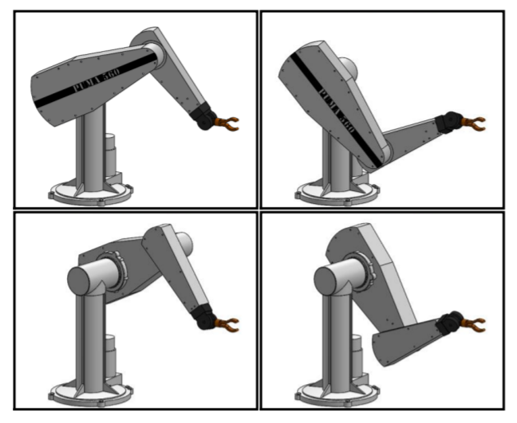
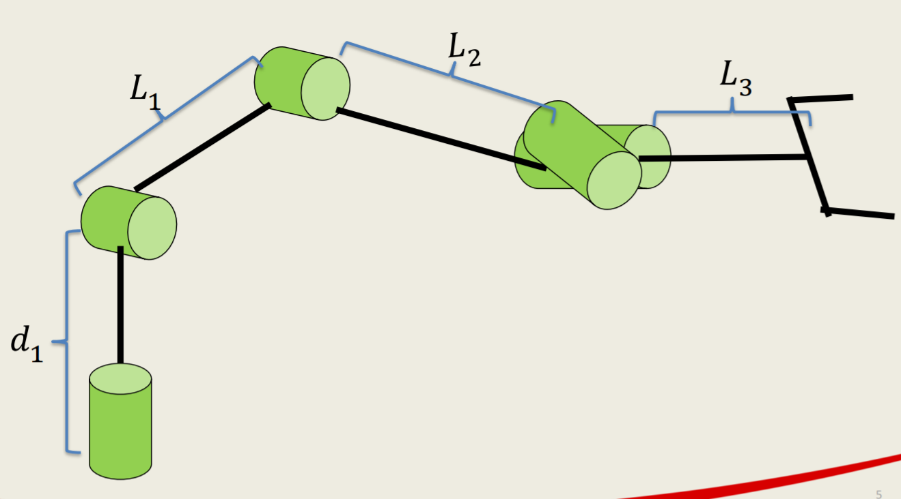
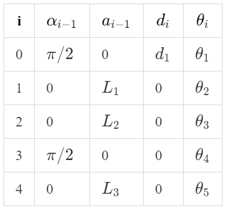
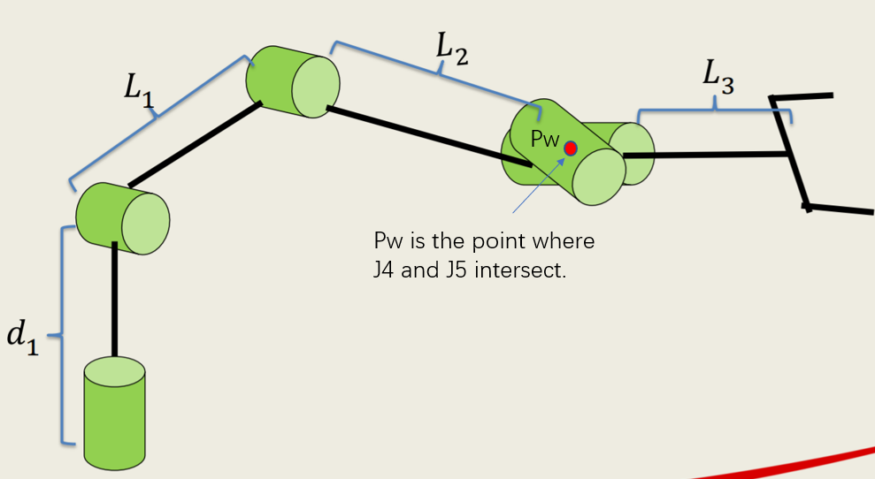
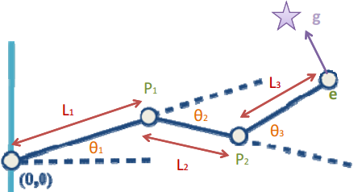
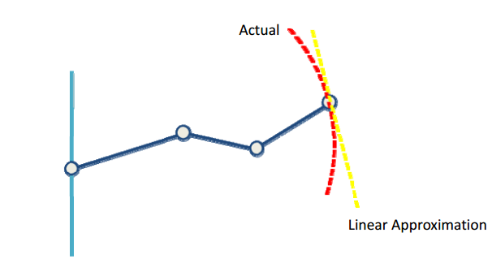

#! https://zhuanlan.zhihu.com/p/430060490
# Lec4. Inverse Kinematics in Matlab (Updating)

> 资料推荐：
> - 推荐课程：[曹博士的课程：ENGR486 【A link to Youtube】](https://www.youtube.com/watch?v=3whQFs0-9Qg&t=747s)
> - [ENGR486 全集](https://www.youtube.com/watch?v=h0WsQ_N-Uyg&list=PLJzZfbLAMTelwaLxFXteeblbY2ytU2AxX&index=8)
> - [Text book for Inverse Kinematics](http://motion.pratt.duke.edu/RoboticSystems/InverseKinematics.html)
> - 推荐资料：[Jafari 的讲义 【百度云】](链接：https://pan.baidu.com/s/1bEuDzKkVnRlyPHvSoTIgWw)提取码：zybg  
> - 优质博客: 
>   - [V-rep学习笔记：机器人逆运动学数值解法（The Jacobian Transpose Method）](https://www.cnblogs.com/21207-iHome/p/5943167.html)
>   - [V-rep学习笔记：机器人逆运动学数值解法（The Pseudo Inverse Method）](https://www.cnblogs.com/21207-iHome/p/5944484.html)

## 1. 概述

### 1.1 正逆运动学

Forward Kinematics:

$$\vec{q}(\theta_n,d_n) \rightarrow _{e}^{0}T
\left\{
    \begin{matrix}
        position\ (x_e,y_e,z_e)\\
        orientation\ (\phi,\theta,\psi)
    \end{matrix}
\right.$$

即，正向运动学是通过 Joints 的转动角度或移动距离来推算末端执行器的位姿。

Inverse Kinematics:

逆向运动学刚好相反，是由末端执行器的位姿来推算 Joints 的状态。

$$ _{e}^{0}T(x_e,y_e,z_e,\phi,\theta,\psi)
\rightarrow \vec{q}(\theta_n,d_n)$$
### 1.2 多样性

在开始讲解逆向运动学之前，读者需要熟知逆向运动学的难点是什么。是对于同一点位机械臂姿态的多样性。具体如下图：

并且随着机器人结构复杂度的增加，其解法的多样性也会增加。
## 2. 示例机械臂

下面的过程都将针对 `5DOF` 的 [Lynxmotion](https://www.robotshop.com/uk/lynxmotion-lss-5-dof-robotic-arm-kit.html?gclid=Cj0KCQjw5oiMBhDtARIsAJi0qk0aTqjh3t4ptAucFN1ATS-QMKLovu6-3nUB6hULnJHMPMif0c3q9VsaAtb4EALw_wcB) 机器人来求解。

机械臂样式：

其 modified D-H 表为：

|i  |$\alpha_{i-1}$|$a_{i-1}$|$d_i$|$\theta_i$|
|-  |-             |-        |-    |-         |
|0  |0             |0        |$d_1$|$\theta_1$|
|1  |$-\pi /2$     |0        |0    |$\theta_2$|
|2  |0             |$L_1$    |0    |$\theta_3$|
|3  |0             |$L_2$    |0    |$\theta_4$|
|4  |0$-\pi /2$    |0        |0    |$\theta_5$|

## 3. Pieper Solution

Pieper solution 是一种特殊的逆向运动学计算方法。只在特定情况下可以使用。本文中的例子恰好属于这种特殊情况，即最后两轴相交于一点。

由于最后两个轴相交于一点，这一点就像是人的手腕一样。只要我们知道了手腕点我位姿，在此点的基础上，我们只需要乘以一个 Euler Angle 的旋转向量和一个位移向量即可以得到 End effector 的坐标位置。

### 3.1 数学思想

首先，Pieper Solution 使用的是 Modified DH。

使用 Pieper Solution 需要将机器人分成两个部分。第一个部分是前三段，即 base to Pw，后一个部分是最后两段，即 Pw to end effector。前三段为 End effector 提供位移，而最后两端可以合并起来看，为 End effector 提供姿态（角度）。因此 End effector 的最终位置其实就是以 Pw 为原点的坐标轴中的一个向量。因此逆向运动学就可以从一个求 5 轴变换的问题转变为一个求 4 轴变换的问题。

$$^{0}P_{5\ OGR}= ^{0}P_{4\ OGR}$$

P 为向量。

对于前三段来说，先通过正向运动学：

$$\begin{aligned}
    ^{i-1}_{i}T &=\left[
            \begin{matrix}
                    𝑐\theta _𝑖&−𝑠\theta _𝑖&0&𝑎_{𝑖−1}\\
                    𝑠\theta _𝑖𝑐\alpha _{𝑖−1}&𝑐\theta _𝑖𝑐\theta _{𝑖−1}&−𝑠\alpha _{𝑖−1}&−𝑠\alpha _{𝑖−1}𝑑_𝑖\\
                    𝑠\theta _𝑖𝑠\alpha _{𝑖−1}&𝑐\theta _𝑖𝑠\alpha _{𝑖−1}&𝑐\alpha _{𝑖−1}&𝑐\alpha _{𝑖−1}𝑑_𝑖\\
                    0&0&0&1\\
            \end{matrix}
                \right]
\end{aligned}$$

可以得出来的 $^{0}_{3}T$ 。又由于：

$$\left[
    \begin{matrix}
        x\\y\\z\\1
    \end{matrix}
\right] = 
^{0}P_{4\ OGR}=^{0}_{1}T ^{1}_{2}T ^{2}_{3}T\  ^{3}P_{4\ OGR}= ^{0}_{3}T\ ^{3}P_{4\ OGR}$$

$$^{3}_{4}T = 
\left[
\begin{array}{ccc|c}
     &   &  &  |\\
     & R &  &  ^{3}P_{4\ OGR}\\
     &   &  &  |\\
    \hline
    0 & 0 & 0 & 1
  \end{array}
\right]$$

因此可以由 $^{0}P_{4\ OGR}$ 构成 3 个方程。由已知数 $x$, $y$, $z$，便可以求解出前三段机械臂的转动角度: $\theta_1$, $\theta_2$, $\theta_3$。但其中可能存在多个解。

之后，在由对于点 Pw 的通过 Y-Z 欧拉角解出 $\theta_4$, $\theta_5$：

$$^{3}_{5}R = ^{0}_{3}R^{-1}\ ^{0}_{6}R$$

### 3.2 Matlab 实现

> 此过程使用了 Robotics toolbox
> 
> 值得借鉴的代码仓库：
>  - [robotics toolbox matlab](https://github.com/petercorke/robotics-toolbox-matlab/blob/master/%40SerialLink)

## 4. Jacobian Matrix 

> 建议拿起纸和笔一起推算

### 4.1 雅各比矩阵简述

我们在使用 Forward Kinematics 的时候会计算出末端执行器在世界坐标中的位置。

$$\left[
    \begin{matrix}
        x\\y\\z
    \end{matrix}
\right]=
\left[
    \begin{matrix}
        f_x(\theta_1,\theta_2...\theta_n)\\
        f_y(\theta_1,\theta_2...\theta_n)\\
        f_z(\theta_1,\theta_2...\theta_n)\\
    \end{matrix}
\right]$$

上面的矩阵式可以简化为：

$$X = f(\theta_s)$$

要解决末端到达目标点问题：

$$\Delta X = J\Delta q$$

其中:
- $\Delta X$ 为末端执行器坐标移动的向量
- $J$ 为雅各比矩阵
- $\Delta q$ 为各个关节移动的角度

$$J = 
\left[
    \begin{matrix}
        \partial x/\partial \theta_1 & \partial x / \partial \theta2 & ... & \partial x / \partial \theta_n \\
        \partial y/\partial \theta_1 & \partial y / \partial \theta2 & ... & \partial y / \partial \theta_n \\
        \partial z/\partial \theta_1 & \partial z / \partial \theta2 & ... & \partial z / \partial \theta_n \\
    \end{matrix}
\right]$$

雅克比矩阵相当于函数 $f(\theta_s)$ 的一阶导数，即线性近似。

### 4.2 雅各比矩阵的计算

上篇：[Forward Kinematics](https://zhuanlan.zhihu.com/p/426994048)
下篇：