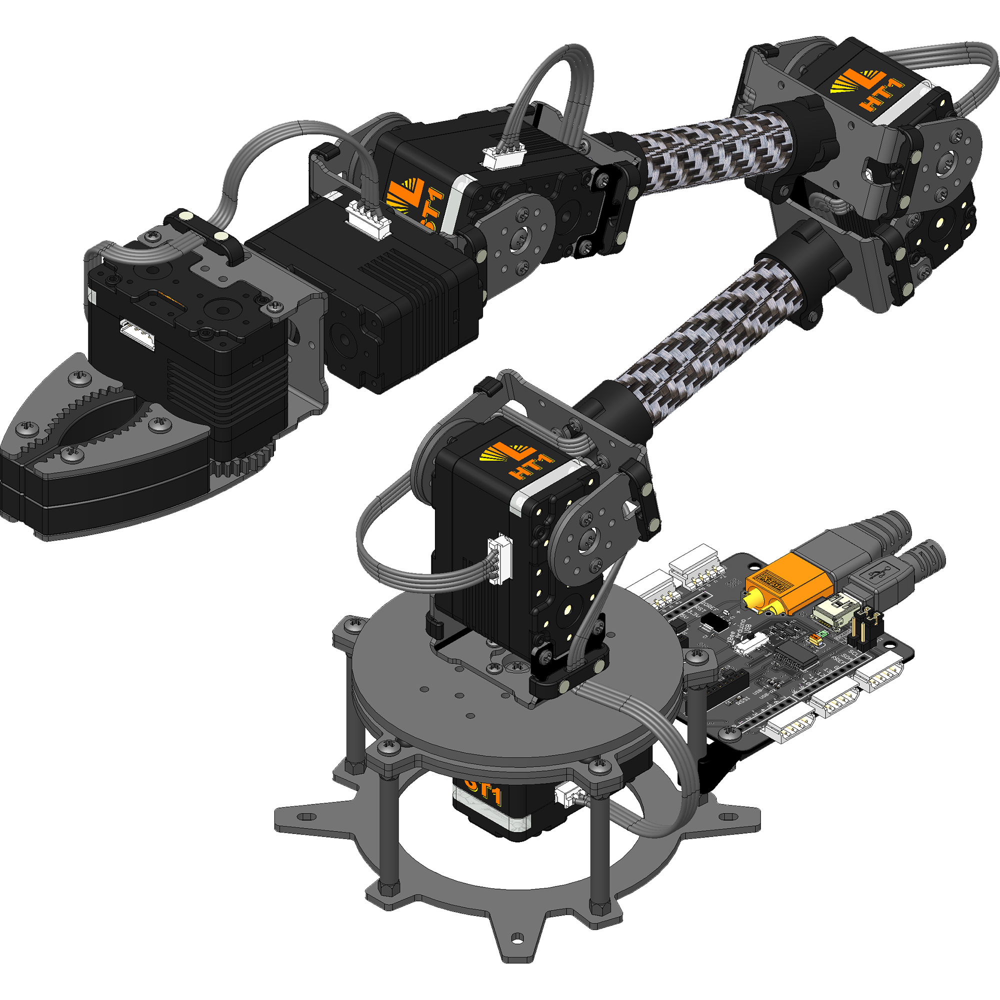
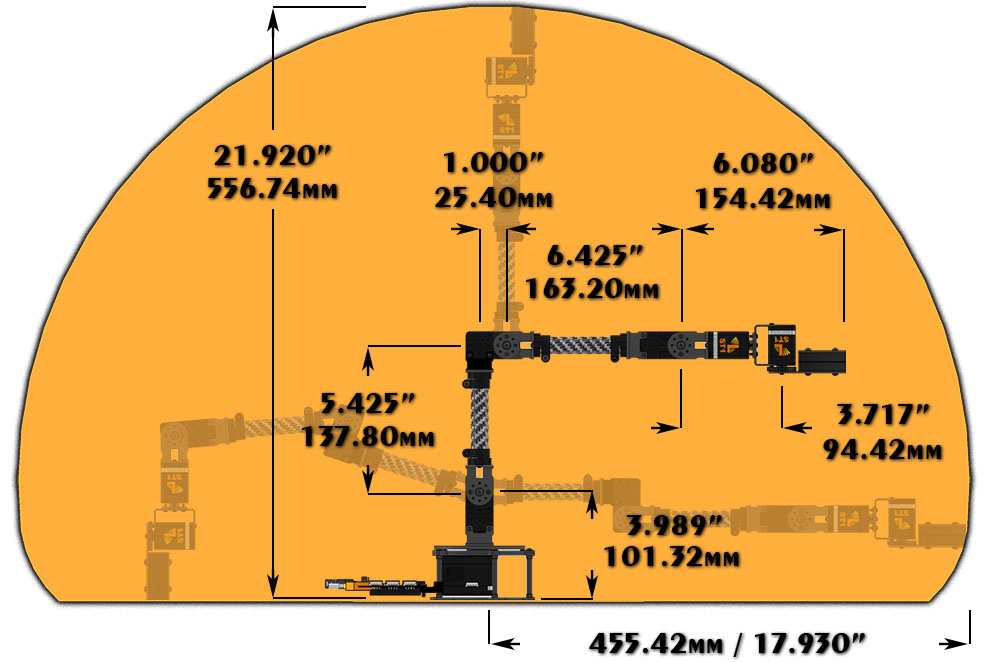

# Lec3. Inverse Kinematics in matlab 

> Useful resource:
> - [Inverse Kenimatics from MathWork](https://uk.mathworks.com/discovery/inverse-kinematics.html)

> 本篇内容主要是记载摸索使用 matlab 编写逆向运动学的过程。这不是最优的解决方案，甚至会让很多内行人笑掉大牙，所以如果你恰好有更好的解决方案，欢迎在评论区留言或直接私信我。

## 1. 示例机械臂

下面的过程都将针对 `5DOF` 的 [Lynxmotion](https://www.robotshop.com/uk/lynxmotion-lss-5-dof-robotic-arm-kit.html?gclid=Cj0KCQjw5oiMBhDtARIsAJi0qk0aTqjh3t4ptAucFN1ATS-QMKLovu6-3nUB6hULnJHMPMif0c3q9VsaAtb4EALw_wcB) 机器人来求解。

机械臂样式：

机械臂尺寸：

其 D-H 表为：

