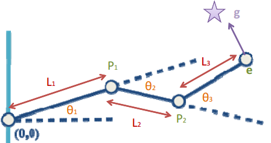

#! https://zhuanlan.zhihu.com/p/445449208
# Lec4. 速度运动学 (Velocity Kinematics)

> 本章推荐课程（无法使用 youtube 但想看视的同学请留下评论）：
> - [web | robogrok](http://www.robogrok.com/Robotics_2.php)
> - [youtube | Finding the Jacobian](https://www.youtube.com/watch?v=SefTCXrpL8U&list=PLT_0lwItn0sAfi3o4xwx-fNfcnbfMrXa7&index=8&ab_channel=AngelaSodemann): 能够快速上手的Jacobian 教学。
> - [youtube | 2014W ENGR486 Lecture12 Jacobian](https://www.youtube.com/watch?v=5irrjW27do0&list=PLJzZfbLAMTelwaLxFXteeblbY2ytU2AxX&index=11&ab_channel=YangCao): 一步步推导 Jacobian 的教学。

## 1. 雅各比矩阵(Jacobian Matrix)

### 1.1 雅各比矩阵简述

Jacobian Matrix 在机械臂运动学中用来计算机械臂末端执行器的速度与各个关节运动速度之间的关系。即：

$$\left[
    \begin{matrix}
        \dot{x}\\ \dot{y}\\ \dot{z}\\
        \omega _x\\ \omega _y \\ \omega _z
    \end{matrix}
\right]=
    J
\left[
    \begin{matrix}
        \dot{q _1}\\ \dot{q _2}\\ .\\
        .\\ .\\ \dot{q _n}
    \end{matrix}
\right]$$

其中：
- $\dot{x},\dot{y},\dot{z}$ 是线速度。
- $\omega _x, \omega _y, \omega _z$ 是角速度
- $J$ 为雅各比矩阵。
- $\dot{q _1}, \dot{q _2}...\dot{q _n}$ 为机械臂各个关节的运动速度。

### 1.2 雅各比矩阵的由来

雅各比矩阵的实质是微分方程式。对于机械臂来说，我们可以通过正向运动学，由关节运动信息，得到机器人位姿，即 $x, y, z, \phi, \theta, \psi$。


$$\left[
    \begin{matrix}
        x\\y\\z\\
        \phi\\ \theta\\ \psi
    \end{matrix}
\right]=
\left[
    \begin{matrix}
        f_x(q_1,q_2...q_n)\\
        f_y(q_1,q_2...q_n)\\
        f_z(q_1,q_2...q_n)\\
        f_{\phi}(q_1,q_2...q_n)\\
        f_{\theta}(q_1,q_2...q_n)\\
        f_{\psi}(q_1,q_2...q_n)\\
    \end{matrix}
\right]$$

上面的矩阵式可以简化为：

$$X = F\left[
    \begin{matrix}
        q _1\\ q _2\\ .\\
        .\\ .\\ q _n\\
    \end{matrix}
\right] = Fq_s$$

将上式左右两边同时关于时间求导，便得到了 1.1 中看到的那个末端执行器的速度与各个关节运动速度之间的关系式。

$$\left[
    \begin{matrix}
        \dot{x}\\ \dot{y}\\ \dot{z}\\
        \omega _x\\ \omega _y \\ \omega _z
    \end{matrix}
\right]=
    J
\left[
    \begin{matrix}
        \dot{q _1}\\ \dot{q _2}\\ .\\
        .\\ .\\ \dot{q _n}
    \end{matrix}
\right]$$


即：

$$\dot{X} = J\dot{{q}}$$

## 1.3 雅各比矩阵的逆

前面我们所使用的雅各比矩阵，都是用关节的速度来求解末端执行器的位姿，即正向运动学。而雅各比矩阵的逆，就是由末端位姿来求解各个关节的速度，即逆向运动学。

$$\dot{q} = J(q)^{-1}\dot{X}$$

对于一个有 6 自由度的机器人来说，我们可以直接对矩阵求逆。但对于一个没有 6 自由度的机器人来说，就不能直接求逆，而是要用 pseudo-inverse 的方法来求逆。

在 Matlab 中的 pseudo-inverse：

```m
B = pinv(A);
```

# 2 雅各比矩阵的推导

## 2.1 微分法

对于一个雅各比矩阵来说，最直接的求法就是用微分的方式来推导。即：

$$J = 
\left[
    \begin{matrix}
        \partial x/\partial q_1 & \partial x / \partial q_2 & ... & \partial x / \partial q_n \\
        \partial y/\partial q_1 & \partial y / \partial q_2 & ... & \partial y / \partial q_n \\
        \partial z/\partial q_1 & \partial z / \partial q_2 & ... & \partial z / \partial q_n \\
        \partial \phi/\partial q_1 & \partial \phi / \partial q_2 & ... & \partial \phi / \partial q_n \\
        \partial \theta/\partial q_1 & \partial \theta / \partial q_2 & ... & \partial \theta / \partial q_n \\
        \partial \psi/\partial q_1 & \partial \psi / \partial q_2 & ... & \partial \psi / \partial q_n \\
    \end{matrix}
\right]$$

> 从上式可以看出，Jacobian Matrix 的行数与机器人末端执行器需要的位姿变量有关，如果只需求解位置信息，则只需要前三行。Jacobian Matrix 的列数与机器人的关节数有关，有几个关节就需要几列。

以一个两节的机械臂为例：


首先由D-H 矩阵和正向运动学得出 X 与 q 的关系：

$$\begin{aligned}
    x &= l_1c_1 + l_2c_{12}\\
    y &= l_1s_1 + l_2s_{12}
\end{aligned}$$

对其求导：

$$\begin{aligned}
    \dot{x} &= -(l_1s_1+l_2s_{12})\dot{\theta_1}-l_2s_{12}\dot{\theta_2}\\
    \dot{y} &= (l_1c_1 + l_2c_{12})\dot{\theta_1} + l2c_{12}\dot{\theta_2}\\
    \dot{x} &= -y\dot{\theta_1}-l_2s_{12}\dot{\theta_2}\\
    \dot{y} &= x\dot{\theta_1} + l2c_{12}\dot{\theta_2}
\end{aligned}$$

即：

$$J = 
\left[  
    \begin{matrix}
        -y & -l_2s_{12}\\
        x  & l_2c_{12} \\
    \end{matrix}
\right]$$

因此：
$$\begin{aligned}
    \dot{X} &= J\dot{{q}}\\
    \left[  
    \begin{matrix}
        \dot{x}\\\dot{y}
    \end{matrix}
    \right]&=
    \left[  
    \begin{matrix}
        -y & -l_2s_{12}\\
        x  & l_2c_{12} \\
    \end{matrix}
    \right]
    \left[  
    \begin{matrix}
        \dot{\theta_1}\\\dot{\theta_2}
    \end{matrix}
    \right]
\end{aligned}$$

看到这里，大家应该发现了，Jacobian 是一个随着时间变化的矩阵。

## 2.2 公式法

为了避免每次求解 Jacobian Matrix 都要求一次微分，可以使用公式法来求解。

这里将 J 分为线速度和角速度两个的 $J_v$ 和 $J_{\omega}$ 分别对应 $\dot{x}, \dot{y}, \dot{z}$ 和 $\omega _x, \omega _y, \omega _z$。

$$\left[
    \begin{matrix}
        \dot{x}\\ \dot{y}\\ \dot{z}\\
        \omega _x\\ \omega _y \\ \omega _z
    \end{matrix}
\right]=
    J
\left[
    \begin{matrix}
        \dot{q _1}\\ \dot{q _2}\\ .\\
        .\\ .\\ \dot{q _n}
    \end{matrix}
\right]=
\left[
    \begin{matrix}
        J_{v1} & J_{v2} & ... & J_{vi} & ... & J_{vn} \\
        J_{\omega 1} & J_{\omega 2} &...& J_ {\omega i} &...& J_{\omega n} 
    \end{matrix}
\right]
\left[
    \begin{matrix}
        \dot{q _1}\\ \dot{q _2}\\ .\\
        .\\ .\\ \dot{q _n}
    \end{matrix}
\right]$$

首先回顾一下齐次矩阵(Homogeneous matrix):

$$T =
\left[  
    \begin{matrix}
        R && d \\
        0 && 1 \\
    \end{matrix}
\right]$$

> 注意这里将 T 简写了，实际上应该是一个 $9\times 9$ 的矩阵。

使用公式法时会遇到两种情况，一种是转动关节(Revolute Joint)，另外一种是移动关节(Prismatic Joint)。

- 对于转动关节 i 来说：
$$\begin{aligned}
        & J_v = R_{i-1}^0
\left[
    \begin{matrix}
        0\\0\\1
    \end{matrix}
\right]
\times (d_n^0 - d_{i-1}^0)\\
& J_{\omega} = R_{i-1}^0
\left[
    \begin{matrix}
        0\\0\\1
    \end{matrix}
\right]
\end{aligned}$$

> n 是总关节数

- 移动关节 i:
$$\begin{aligned}
        & J_v = R_{i-1}^0
\left[
    \begin{matrix}
        0\\0\\1
    \end{matrix}
\right]\\
& J_{\omega} = 
\left[
    \begin{matrix}
        0\\0\\0
    \end{matrix}
\right]
\end{aligned}$$

# 3. 雅各比矩阵的应用

雅各比矩阵可以用来解决机器人运动轨迹的问题，比如下图的机器人从 e 点运动到 g 点的问题。




$$\Delta X = J\Delta q$$

其中:
- $\Delta X$ 为末端执行器坐标移动的向量
- $J$ 为雅各比矩阵
- $\Delta q$ 为各个关节移动的角度

具体解法将在下一篇介绍。

- 上篇：[逆向运动学(Inverse Kinematics)](https://zhuanlan.zhihu.com/p/426994048)
- 下篇：[]()