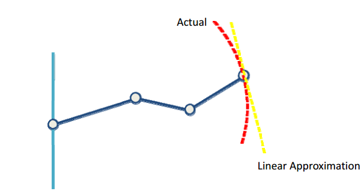

# Lec4. 逆向运动学 (Inverse Kinematics) - 2

> 本章推荐课程：
> - [web | robogrok](www.robogrok.com)
> - [youtube | Finding the Jacobian](youtube.com/watch?v=SefTCXrpL8U&list=PLT_0lwItn0sAfi3o4xwx-fNfcnbfMrXa7&index=7&ab_channel=AngelaSodemann)
> - [youtube | 2014W ENGR486 Lecture12 Jacobian](https://www.youtube.com/watch?v=5irrjW27do0&list=PLJzZfbLAMTelwaLxFXteeblbY2ytU2AxX&index=11&ab_channel=YangCao)

## 1. 雅各比矩阵(Jacobian Matrix)

jacobian Matrix 在机械臂运动学中用来计算机械臂末端执行器的速度与各个关节运动速度之间的关系。

### 1.1 雅各比矩阵简述

我们在使用 Forward Kinematics 的时候会计算出末端执行器在世界坐标中的位置。

$$\left[
    \begin{matrix}
        x\\y\\z
    \end{matrix}
\right]=
\left[
    \begin{matrix}
        f_x(\theta_1,\theta_2...\theta_n)\\
        f_y(\theta_1,\theta_2...\theta_n)\\
        f_z(\theta_1,\theta_2...\theta_n)\\
    \end{matrix}
\right]$$

上面的矩阵式可以简化为：

$$X = f(\theta_s)$$

要解决末端到达目标点问题：

$$\Delta X = J\Delta q$$

其中:
- $\Delta X$ 为末端执行器坐标移动的向量
- $J$ 为雅各比矩阵
- $\Delta q$ 为各个关节移动的角度

$$J = 
\left[
    \begin{matrix}
        \partial x/\partial \theta_1 & \partial x / \partial \theta2 & ... & \partial x / \partial \theta_n \\
        \partial y/\partial \theta_1 & \partial y / \partial \theta2 & ... & \partial y / \partial \theta_n \\
        \partial z/\partial \theta_1 & \partial z / \partial \theta2 & ... & \partial z / \partial \theta_n \\
    \end{matrix}
\right]$$

雅克比矩阵相当于函数 $f(\theta_s)$ 的一阶导数，即线性近似。

### 1.2 雅各比矩阵的计算