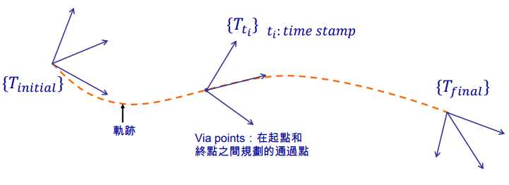
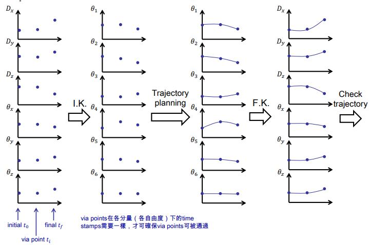
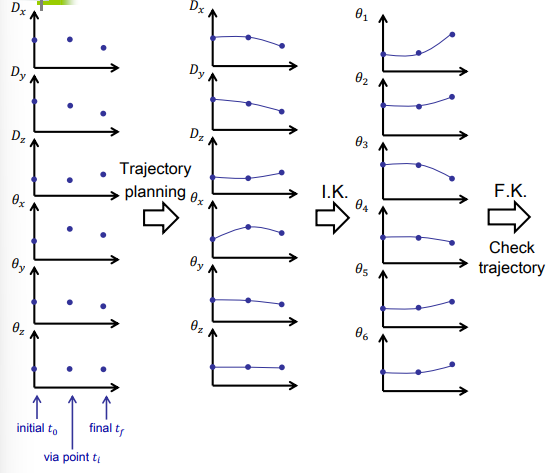
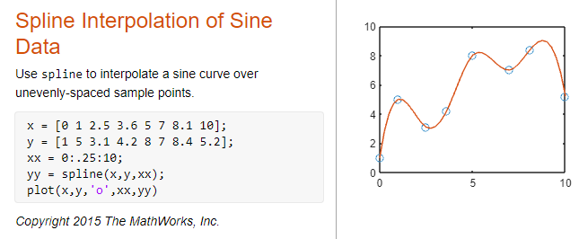
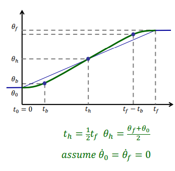

#! https://zhuanlan.zhihu.com/p/445941991
# Lec6. 轨迹规划 (Trajectory Plan)

## 1. 简介

在机械臂中，我们将机器人末端执行器移动时的位姿随时间变化而得出的曲线称为其轨迹。我们之所以需要对机器人的轨迹进行规划是因为通常来说，我们对机器人的输入只有工具的起点和终点。而我们需要让机器人能够自然平滑的按照我们想要的方式从起点移动到终点，所以需要设计一个算法，使得机器人在移动的过程中，无论是位置的变化还是速度的变化都是连续且平滑的，有时，也会要求加速度的变化为连续的。

## 2. 机械臂轨迹规划的种类

对于机械臂来说由两种空间下的轨迹规划，一种是基于关节空间 (Joint-space)， 另外一种是基于世界空间 (Cartesian-space)。

## 2.1 Joint-Space

对 Joint-Space 来说进行轨迹规划需要以下步骤：

1. 确定轨迹的起点(Initial Point) - 途径点(Via Point) - 终点(Finial Point)
2. 通过 Inverse Kinematics (IK) 计算出以上所有点的 Joint Angle，即 Joint-space 下的所有点关于时间的位置.
3. 设计一条轨迹将 Joint-space 所有点都平滑的连接起来。
4. 再通过 Forword Kinematics (FK) 算出在这种情况下末端关于世界坐标的曲线。
5. 检查世界坐标下的曲线是否合理。

## 2.2 Cartesian-space

对 Cartesian-space 来说进行轨迹规划需要以下步骤：

1. 确定轨迹的起点(Initial Point) - 途径点(Via Point) - 终点(Finial Point)
2. 设计一条曲线将 Cartesian-space 所有点都平滑的连接起来。
3. 使用 IK 计算出这条曲线在 Joint-space 的曲线。
4. 检查 Joint-space 的曲线是否平滑。

## 2.3 两种方法的对比

Cartesian-space 来做轨迹规划是一种直观的对位姿轨迹的规划。但可能出现机器人的运动速度上的不平滑。

Joint-space 可以保证运动速度的平滑，但是运动位姿的轨迹可能与设计前预想的轨迹有区别，不会出现尖锐的拐角。

一般来说需要根据实际应用的情况来选择使用那种方法来设计轨迹。

## 2.4 奇点 (singularity)

对于多轴机器人来说，当机器人的位置处于奇点的时候，机器人会失去至少一个自由度。这可能会导致机器人在此处卡住。所以应该尽量避免奇点。

由几何法找奇点会比较复杂，较为简单的方法是根据[雅各比矩阵](https://zhuanlan.zhihu.com/p/445449208)来判断。当：

$$det(J) = 0$$

> determinat(det) 即行列式。

时，机器人就在奇点上。

## 3. 轨迹规划的算法

这里所说的轨迹规划算法，实际上就是经过多点的平滑曲线拟合算法。如果使用多项式拟合，通常需要使用三次以上的多项式来拟合。线性拟合也可以，如抛物线混合 (Parabolic Blends)。由于曲线需要经过每一个点，所以不能用贝塞尔曲线来设计轨迹。

### 3.1 多项式拟合(Polynomials Spline)

#### 3.1.1 三次样条插值(Cubic Spline Interpolation)

> 推荐 Blog [Timo Denk's Blog](https://timodenk.com/blog/cubic-spline-interpolation/)
> 
> 在线计算器 [Cubic spline interpolation](https://tools.timodenk.com/cubic-spline-interpolation)

首先假设有 N+1 个点 $(x_1, x_{n+1})$，要将这 N+1 个点两两相连组成一条连续的曲线需要 n 个三次多项式，$f_1, f_2, ..., f_n$。

$$f\left(x\right)=\begin{cases} 
a_1x^3+b_1x^2+c_1x+d_1&\text{if }x\in\left[x_1,x_2\right]\\ 
a_2x^3+b_2x^2+c_2x+d_2&\text{if }x\in\left(x_2,x_3\right]\\ 
\dots\\ 
a_nx^3+b_nx^2+c_nx+d_n&\text{if }x\in\left(x_{n},x_{n+1}\right]\,. 
\end{cases}$$

要注意，每一个多项式，只在固定的范围内有效，即对$f_i$ 来说，只在$[x_i,x_{i+1}]$ 有效。

对于这个多项式而言，需要求解的就是$a_i, b_i, c_i, d_i$。对于 $n$ 个多项式而言，需要有 $4n$ 个条件才可以完全求解这些参数。为了让曲线可以平滑的相连，可以使用以下的条件对多项式进行约束，从而求解。

首先，已知每个多项式恰好通过两点，因此我们获得了 $2n$ 个条件：
$$\begin{align} 
    f_1(x_1)&=y_1\\ 
    f_1(x_2)&=y_2\\ 
    f_2(x_2)&=y_2\\ 
    f_2(x_3)&=y_3\\ 
    \cdots\\ 
    f_n(x_n)&=y_n\\ 
    f_n(x_{n+1})&=y_{n+1}\,, 
\end{align}$$

计算式为：

$$\begin{align} 
a_1x_1^3+b_1x_1^2+c_1x_1+d_1&=y_1\\ 
a_1x_2^3+b_1x_2^2+c_1x_2+d_1&=y_2\\ 
a_2x_2^3+b_2x_2^2+c_2x_2+d_2&=y_2\\ 
a_2x_3^3+b_2x_3^2+c_2x_3+d_2&=y_3\\ 
\dots\\ 
a_nx_n^3+b_nx_n^2+c_nx_n+d_n&=y_n\\ 
a_nx_{n+1}^3+b_nx_{n+1}^2+c_nx_{n+1}+d_n&=y_{n+1} 
    \end{align}$$

任意两个相邻的多项式曲线而言，上一段的终点和下一段的起点是重合的。并且为了使这两段曲线能够平滑的相连，还需要满足此点处两条曲线的一次微分和二次微分相等。

> 对机器人而言，一次微分为速度，二次微分为加速度。

$$\begin{aligned}
      \frac{d}{dx}f_i(x_{i+1}) &= \frac{d}{dx}f_{i+1}(x_{i+1})\\
    \frac{d^2}{dx^2}f_i(x_{i+1}) &= \frac{d^2}{dx^2}f_{i+1}(x_{i+1})
\end{aligned}$$

对整体而言为：
$$\begin{align} 
    \frac{d}{dx}f_1(x)&=\frac{d}{dx}f_2(x)&\vert_{x=x_2}\\ 
    \frac{d}{dx}f_2(x)&=\frac{d}{dx}f_3(x)&\vert_{x=x_3}\\ 
    \cdots\\ 
    \frac{d}{dx}f_{n-1}(x)&=\frac{d}{dx}f_n(x)&\vert_{x=x_n}\ 
\end{align}$$

$$\begin{align} 
    \frac{d^2}{dx^2}f_1(x)&=\frac{d^2}{dx^2}f_2(x)&\vert_{x=x_2}\\ 
    \frac{d^2}{dx^2}f_2(x)&=\frac{d^2}{dx^2}f_3(x)&\vert_{x=x_3}\\ 
    \cdots\\ 
    \frac{d^2}{dx^2}f_{n-1}(x)&=\frac{d^2}{dx^2}f_n(x)&\vert_{x=x_n}\ 
\end{align}$$

到目前为止，我们已经获得了 $2(n-1)$ 个条件了，最后两个条件为边界条件 (Boundary Conditions) 即对点集的起始与终止点附加条件。关于这个附加条件有以下几种可以选项：

- 使起点和终点的二次微分为 0 (Natural cubic spline)

$$\frac{d^2}{dx^2}f_{1}(x_1)=\frac{d^2}{dx^2}f_n(x_{n+1})=0$$

- 使起点和终点的一次微分为 0 (Clamped cubic spline)

$$\frac{d}{dx}f_{1}(x_1)=\frac{d}{dx}f_n(x_{n+1})=0$$

- 当起点和终点重合的时候，使一次和二次微分相等 (Periodic cubic spline)

$$\begin{aligned}
f_1(x_1) &= f_n(x_{n+1})\\
\frac{d}{dx}f_{1}(x_1)&=\frac{d}{dx}f_n(x_{n+1})\\
\frac{d^2}{dx^2}f_{1}(x_1)&=\frac{d^2}{dx^2}f_n(x_{n+1})\\
\end{aligned}$$

> 在 Matlab 中可以使用 spline 命令来创建样条曲线。

#### 3.1.2 五次样条插值(Quintic Spline Interpolation)

与三次的算法相似，在 Matlab 中可以使用命令 `spapi` 来计算。

除此之外还有命令 `pchi` 和 `makima` 用于生成样条线。

### 3.2 抛物线混合(Parabolic Blends)

> 推荐视频 [Trajectory planning, Part 3: Linear functions with parabolic blends](https://www.youtube.com/watch?v=-djAWt2lQ0c&ab_channel=MechanicalEngineering_Learnfaster)

原理就是消除位置转折处的速度突变，用恒定的一个加速度，使速度在转角处逐渐改变，从而获得一个圆滑的转角。

- 上篇：[速度运动学 (Velocity Kinematics)](https://zhuanlan.zhihu.com/p/445449208)
- 下篇：

